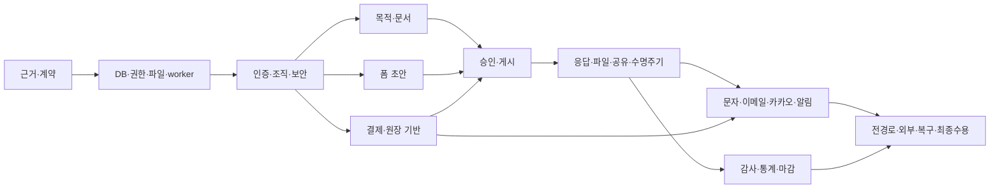

# 실행 순서와 마일스톤 의존성

일정/소요시간을 임의로 단정하지 않는다. 아래 작업군은 선행 게이트가 충족되면 시작 가능한 논리적 순서다. 여러 작업이 한 행에 있다는 것은 자동으로 별도 에이전트를 생성하라는 지시가 아니다.

| 작업군 | 시작 가능한 Task |
|---|---|
| 1 | R00-T01 |
| 2 | R00-T02 |
| 3 | R00-T03 |
| 4 | R00-T04 |
| 5 | R01-T01 |
| 6 | R01-T02 |
| 7 | R01-T03, R01-T04 |
| 8 | R01-T05 |
| 9 | R02-T01 |
| 10 | R02-T02 |
| 11 | R02-T03 |
| 12 | R02-T04 |
| 13 | R03-T01, R24-T01 |
| 14 | R03-T02, R24-T02 |
| 15 | R03-T03, R24-T03 |
| 16 | R03-T04, R24-T04 |
| 17 | R04-T01 |
| 18 | R04-T02 |
| 19 | R04-T03 |
| 20 | R04-T04 |
| 21 | R05-T01, R06-T01, R21-T01, R22-T01 |
| 22 | R05-T02, R06-T02, R21-T02, R22-T02 |
| 23 | R05-T03, R06-T03, R21-T03, R22-T03 |
| 24 | R05-T04, R06-T04, R21-T04, R22-T04 |
| 25 | R07-T01, R08-T01, R10-T01 |
| 26 | R07-T02, R08-T02, R10-T02 |
| 27 | R07-T03, R08-T03, R10-T03 |
| 28 | R07-T04, R08-T04, R10-T04 |
| 29 | R09-T01 |
| 30 | R09-T02 |
| 31 | R09-T03 |
| 32 | R09-T04 |
| 33 | R11-T01 |
| 34 | R11-T02 |
| 35 | R11-T03 |
| 36 | R11-T04 |
| 37 | R12-T01, R13-T01, R14-T01, R16-T01, R20-T01 |
| 38 | R12-T02, R13-T02, R14-T02, R16-T02, R20-T02 |
| 39 | R12-T03, R13-T03, R14-T03, R16-T03, R20-T03 |
| 40 | R12-T04, R13-T04, R14-T04, R16-T04, R20-T04 |
| 41 | R15-T01 |
| 42 | R15-T02 |
| 43 | R15-T03 |
| 44 | R15-T04 |
| 45 | R17-T01, R23-T01 |
| 46 | R17-T02, R23-T02 |
| 47 | R17-T03, R23-T03 |
| 48 | R17-T04, R23-T04 |
| 49 | R18-T01, R19-T01 |
| 50 | R18-T02, R19-T02 |
| 51 | R18-T03, R19-T03 |
| 52 | R18-T04, R19-T04 |
| 53 | R25-T01 |
| 54 | R25-T02, R25-T05 |
| 55 | R25-T03, R25-T04 |
| 56 | R25-T06 |

외부 자격증명 대기 중에도 로컬 수용 통과를 선행게이트로 삼아 후속 내부 구현을 계속한다. 실제 provider 검증은 R25-T03과 R25-T06 전체완료 조건이다.
각 도메인 T01은 새 테이블을 무조건 추가하는 작업이 아니다. 현재 구현이 명세를 충족하면 재사용과 검증 근거를 기록한다.

2026-10-10 F3 국내 연락처·이메일2종·생년월일: 질문13유형·역할/채널 바인딩·migration114·원본 문자열 직렬화·고정 검증 구현. 고유7파일125개·HTTP11·Ego 제출/취소복원/정정·재시작 폼1/응답1/정정1/동의3/감사15건 및 기존10세트 보존 통과. 이미지 캡처 시간초과는 미검증으로 남기며 국제전화/주소/서명/메타데이터/다중페이지 및 전체수용은 계속 진행. 전체목표 active 유지.

- 2026-10-10 수동 개인정보 분류 checkpoint: migration120, 최종11파일103시험·Ego CRUD/게시/제출/개정/구응답 정정/PDF·재시작 hash64368a29…·기존16fixture·소스617지문 통과. docs/qa/R08-T02/question-metadata/personal-information/README.md. 전체0완료/53진행/54계획·goal active.

F3 기타 직접입력: nullable isCustomValue/migration121·세 선택형/질문당1개/마지막 보기·100 UTF-16 strict 객체·현재 설정 보존/명시해제·기존 일반 답변/긴 이름 호환·조건/정정/공유/CSV 연결. 최종15파일182시험, 실제 Ego CRUD·자동저장 stale 확인 거절·공개 제출/개정/구 응답 정정·로컬메일 공유/회수·CSV/PDF 다운로드 통과. 폼1/게시2/응답1/정정1/감사36·production 재시작과 이전17fixture 지문 보존. FILE/보기 이미지/NLP/자동동의/다중페이지·시각/전체수용은 잔여.
