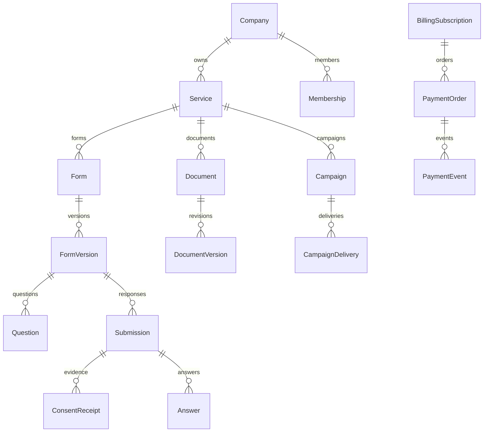

# 데이터 모델·관계·변경 계획

Prisma schema 파일에서 현재128모델을 추출했다. **원본사이트 서버 스키마를 알아낸 것이 아니다.** 모델이 존재한다는 사실과 구현/마이그레이션/실제 동작 통과는 구분한다. 원본41 Redux 상태도 서버 테이블로 간주하지 않는다.

모델 신규추가는 누락필드/관계를 대조한 후 필요한 경우에만 수행한다. 현재 FK/unique/index/version을 우선 재사용하고 기존 migration SQL은 덮어쓰지 않는다. 전체 원문은 `snapshots/prisma-models.json`에 있다.

## 주요 관계



이 도식은 주요 관계만 표시한다. 실제복합tenant FK와 삭제규칙은 아래 schema를 따른다.

## R02 계정 인증·세션·복구

현재 Better Auth 테이블을 재사용한다. 이메일 중복·만료·한 번만 쓰는 인증, 암호 이력, 복구코드 소비, 세션 폐기를 DB 제약과 트랜잭션으로 대조한다.

C 가입·인증 challenge; R 세션/암호정책; U 암호·2FA; D 세션 폐기·2FA 해제. 계정 삭제는 R05.

관련모델: `User`, `Account`, `Session`, `Verification`, `TwoFactor`, `RateLimit`, `PasswordHistory`, `PasswordDeferral`

## R03 회사·서비스·초기 설정

Company→Service tenant FK, 회사 내 서비스명 unique, Membership/ServiceGrant 관계, 사업자 파일 소유권과 version을 검사한다. 회사 종료와 구성원 탈퇴를 구분한다.

C 회사/서비스/접근요청; R 목록·상세·현재 컨텍스트; U 기본정보/이름/요청결정; D 서비스 보관·회사 종료요청. 참조 데이터 즉시 cascade 삭제 금지.

관련모델: `Company`, `CompanyBusinessFile`, `Service`, `Membership`, `ServiceGrant`, `AccessRequest`

## R04 구성원·초대·권한·전문가

회사별 멤버십·서비스 권한의 복합 FK 및 중복 초대 방지, 초대 만료/수락 1회, 전문가 배정 범위·기간·version을 확인한다. 마지막 owner 제거를 차단한다.

C 초대/서비스 권한/전문가 배정; R 목록·초대미리보기; U 역할·담당범위·소유권 이전; D 초대취소/권한회수/배정해제.

관련모델: `Membership`, `ServiceGrant`, `Invitation`, `AccessRequest`, `ExpertAssignment`, `ExpertAssignmentService`

## R05 MY·프로필·활동 검토·탈퇴

자기 사용자 범위와 회사별 활동 검토 scope를 분리한다. 탈퇴요청 사유 암호화·보존, 마지막 owner 제약, 검토 메시지/답변의 수정 정책과 감사 근거를 정리한다.

C 활동 검토요청·탈퇴요청; R 프로필/내 활동/검토; U 이름·연락처·검토 응답; D 세션·연결 계정 해제, 탈퇴는 상태 전이.

관련모델: `User`, `AccountClosure`, `Session`, `Account`, `ActivityReview`, `ActivityReviewMessage`

## R06 회사 보안정책·IP·MFA

회사 단일 정책, IP/CIDR 정규화·중복, IPv4/IPv6, MFA 예외 만료와 version을 점검한다. 보안 수치의 원본 미확인 기본값을 확정 사실로 기록하지 않는다.

C IP 규칙/MFA 예외; R 정책·보안현황; U 정책·예외기간·활성; D 규칙·예외 삭제/정책 초기화.

관련모델: `SecurityPolicy`, `IpAccessPolicy`, `IpRule`, `MfaException`, `PasswordHistory`, `PasswordDeferral`, `TwoFactor`

## R07 SSO·OAuth·기관 인증

기관별 issuer·client·인증서와 암호화 secret, state/nonce·만료·소비 제약을 대조한다. VirtualOrgMember는 가상시험용임을 유지하며 실제 기관 신원 모델과 혼동하지 않는다.

C SSO 공급자/인증 state/계정연결; R 설정·preflight; U 설정·활성; D 공급자 비활성/계정연결 해제. callback은 검증 후 1회 처리.

관련모델: `SsoProvider`, `SsoState`, `Account`, `Session`, `VirtualOrgMember`, `Verification`

## R08 캐치폼·질문·템플릿·단계 편집

Form와 버전/질문/보기 관계, 게시본 불변·draft revision, 질문 순서·필수·조건·옵션 ID 안정성을 확인한다. 원본 번들 question·policy 세부항목과 현재 계약의 누락 필드 표를 만든다.

FormVersion의 `consentItemSchemaVersion`·`consentItems`는 문항별 수동 개인정보 분류에서 파생한 버전 고정 증거다. schema1은 NONE을 제외하고 질문/항목 순서와 중복을 그대로 보존하며 DB 지연 트리거가 Question 투영과 일치를 검사한다. 기존 버전은 승인 지문·영수증 불변을 위해 schema0/NULL로 유지한다.

C 폼/초안/질문/보기/템플릿/복제; R 목록·상세·초안; U 순서·문구·유형·단계 설정; D 미사용 초안·질문·템플릿 보관.

관련모델: `Form`, `FormVersion`, `Question`, `QuestionOption`, `FormFavorite`, `FormTemplate`, `FormDocumentBinding`

## R09 폼 승인·게시·고정 URL

승인대상 버전 해시·게시 포인터·토큰 hash·고정slug unique와 만료를 확인한다. 승인 뒤 내용 변경 시 승인 유효성 및 참조 버전 고정을 명시한다.

C 승인요청/게시/고정URL; R 승인상세·게시상태; U 승인결정·URL 대상·재개; D 승인취소·URL 폐기·게시중단.

관련모델: `ApprovalRequest`, `Publication`, `FixedUrl`, `Form`, `FormVersion`

## R10 처리 목적·동의서·처리방침·서비스 공개문서

목적↔항목↔제공자와 DocumentVersion 스냅샷 관계를 대조한다. 국외이전·아동·CCTV·자동화 결정·권리담당자 등 역공학 상태에 있는 필드를 실제 schema/DTO 지원 여부별로 확정한다.

C 목적/제공·수탁자/문서/문구; R 목록·버전·공개/PDF; U 초안·표시문구·재위탁; D 보관·복구·게시폐기. 증거 참조 버전은 불변.

관련모델: `ProcessingPurpose`, `Recipient`, `Subprocessor`, `PurposeRecipient`, `PurposeRevision`, `RecipientRevision`, `Document`, `DocumentPurpose`, `DocumentRecipient`, `DocumentVersion`, `DocumentPdf`, `DocumentPublication`, `ClauseTemplate`, `ServiceConsentDisplay`, `FormDocumentBinding`, `SubprocessorNotice`

## R11 공개 폼·응답·첨부·정정

Submission→FormVersion→Answer/ConsentReceipt와 파일 바인딩, 원본문항·동의문구·timestamp 보존을 검증한다. 정정 payload 암호화, 파일 검사 상태, export source 참조 및 purge 후 불가역 비노출을 설계한다.

C 제출/동의영수증/첨부/메모; R 응답·파일·내보내기; U 정정/메모/보유기간; D 메모·미참조첨부, 개인정보 삭제는 파기요청.

관련모델: `Submission`, `Answer`, `ConsentReceipt`, `ConsentEvent`, `Correction`, `CorrectionPayload`, `SubmissionNote`, `FileObject`, `ExportJob`, `ExportChunk`, `ExportSource`

## R12 외부 공유·열람자 인증

공유권한은 회사·서비스·폼버전·허용필드·대상범위·만료를 가진다. 코드/인증 challenge hash·시도제한·세션 generation으로 권한 수정/회수 뒤 기존세션을 무효화한다.

C 공유권한/열람 challenge; R 공유목록·허용 응답; U 허용필드·기간·대상; D 권한회수/열람세션 폐기.

관련모델: `ShareGrant`, `ShareField`, `ViewerChallenge`, `ViewerSession`

## R13 정보주체·동의이력·본인인증

동명이인/동일이메일 다른서비스 분리 기준을 확정하고 SubjectAccessScope를 서버에서 좁힌다. 본인인증 결과와 폼버전/사용 목적을 불변 결합하고 secret은 암호화한다.

C 본인조회 challenge/철회요청/인증설정; R 자기동의·처리이력; U 인증설정·철회확정/취소; D 인증설정 비활성·세션종료.

관련모델: `DataSubject`, `SubjectAccessRequest`, `SubjectAccessScope`, `SubjectSession`, `SubjectWithdrawal`, `VerificationIntegration`, `VerificationIntegrationRevision`, `VerificationAttempt`, `VerificationEvent`, `VerificationReceipt`, `Suppression`

## R14 개인정보 업로드·이관

파일→헤더매핑→행검증→동의/출처증빙→Submission 변환 관계와 (tenant,job,rowNo)unique를 검사한다. 오류행·부분성공 정책과 원본파일 보존/삭제 시점을 명시한다.

C 업로드job·행; R 검사결과·오류CSV·진행상태; U 매핑/동의증빙·재검증; D 미실행작업취소·파일정리. commit 이후 증빙은 보존.

관련모델: `ImportJob`, `ImportRow`, `ImportEvidence`, `Submission`, `Answer`, `FileObject`

## R15 광고 동의·수신거부

주체·서비스·채널별 동의, 취득출처/일시/문구버전, 철회이벤트와 억제목록의 연결을 확인한다. 중복수신자 통합 기준과 목적별 동의범위를 명시한다.

C 근거 있는 동의등록; R 동의목록·집계·내보내기; U 채널별 동의/철회; D 근거 삭제가 아닌 동의회수·보존정책 적용.

관련모델: `MarketingPreference`, `MarketingEvent`, `Suppression`, `SubjectWithdrawal`

## R16 보유기간·파기 일정·증명서

RetentionRule(service unique)→Form 지정→Submission.retentionUntil 우선순위, legalHold·승인·파기증명서를 대조한다. 파일/내보내기/캠페인 복제본까지 파기 범위를 추적한다.

C 보유규칙/파기요청; R 기간·예정목록·증명서; U 보유기간·승인·보류·재예약; D 규칙보관·요청취소·승인된 실제파기. 증명서 수정/임의삭제 없음.

관련모델: `RetentionRule`, `DestructionRequest`, `DestructionCertificate`, `Submission`, `FileObject`, `Job`, `ExportSource`

## R17 발신번호·문자 캠페인

발신번호 검증·증빙파일 및 Campaign→CampaignDelivery→SmsReceipt 고유키, 크레딧예약/정산을 확인한다. 전화번호 정규화·중복 제거·예약 timezone·발신자 변경 버전 고정을 명시한다.

C 발신자·초안·수신자·템플릿; R 인증/발송내역; U 초안·예약·기본발신자; D 초안·발신자 비활성/예약취소. 발송완료는 receipt 이력 유지.

관련모델: `Sender`, `SenderVerification`, `SenderEvent`, `Campaign`, `CampaignDelivery`, `CampaignEvent`, `SmsReceipt`, `MessageTemplate`, `MessageTemplateRevision`

## R18 발신메일·이메일 발송·수신거부

템플릿 revision/발송당 HTML·첨부 snapshot, email suppression unique, 반송이벤트 idempotency를 대조한다. 발신 DNS/주소인증 상태는 서버 증거로만 변경한다.

C 발신주소/메일초안/첨부/템플릿; R DNS·내역·반송; U 내용·예약·템플릿; D 초안·첨부·예약취소, 발신주소 비활성. 구독취소는 억제 이벤트.

관련모델: `Sender`, `SenderVerification`, `Campaign`, `CampaignDelivery`, `CampaignEvent`, `MessageTemplate`, `MessageTemplateRevision`, `EmailFeedback`, `EmailSuppression`, `FileObject`

## R19 알림톡 채널·템플릿·발송

채널귀속·템플릿버전/심사상태/변수·버튼·이미지·fallback snapshot을 대조한다. KakaoMockReceipt는 실제카카오 receipt로 집계하지 않는다.

C 채널·템플릿·발송초안; R 목록·상세·심사/발송내역; U 초안·반려수정·활성; D 미사용채널/템플릿보관. 승인본 수정은 재심사.

관련모델: `KakaoChannel`, `KakaoTemplate`, `KakaoMockReceipt`, `Campaign`, `CampaignDelivery`, `CampaignEvent`

## R20 알림 받기·웹훅·이메일 알림

integration→subscription(service/form/event)과 delivery/attempt, 암호화endpoint 및 generation을 검사한다. 화면에서 본 9이벤트를 서버 발생지와 일대일 대응시킨다.

C 알림설정/이벤트구독; R 설정·전송이력; U 대상·채널·활성; D 설정해제·일괄삭제. 전달결과는 append-only.

관련모델: `NotificationIntegration`, `NotificationSubscription`, `NotificationEvent`, `NotificationDelivery`, `NotificationAttempt`

## R21 라이선스·결제수단·주문·원장·환불

가격버전·회사구독·billing method·order/event/refund·복식원장 제약을 확인한다. 금액은 정수, 통화/가격snapshot, eventId unique, 잔액합계·환불누계 불변조건을 정의한다.

C 구독/결제수단/주문/환불요청; R 상품·자산·원장·청구서; U 기본수단·예약해지/취소; D 수단삭제·구독해지. 승인결제/원장은 보정 이벤트만.

관련모델: `BillingPlan`, `BillingPlanVersion`, `BillingSubscription`, `BillingSubscriptionEvent`, `PaymentMethod`, `PaymentOrder`, `PaymentEvent`, `PaymentRefund`, `BillingMonthClose`, `CreditAccount`, `LedgerTransaction`, `LedgerEntry`

## R22 개인정보·권한·활동 감사로그

tenant/service/actor/resource/requestId·시간·detail의 최소증거 필드를 대조한다. 현재 UI에서 IP·고객번호·사유가 - 처리되는 영역은 합법적 수집근거/보존과 함께 수집·마스킹 계약을 확정한다.

C 실제업무 처리시 서버가 이벤트 추가; R 필터·상세·CSV; U/D 원장 직접 조작 없음. 검토요청·응답은 별도 resource 상태전이.

관련모델: `AuditEvent`, `ActivityReview`, `ActivityReviewMessage`, `ExportJob`

## R23 대시보드·통계·준수·월마감

원천조회→서비스필터→기간버킷→snapshot과 근거hash를 대조한다. ComplianceClose와 BillingMonthClose를 다른 모델로 유지한다. 근거없는 점수/과태료를 실제 계산으로 제시하지 않는다.

C 월마감 snapshot/출력job; R 대시보드·개인정보/광고통계·마감자료; U/D 수치 직접변경 없음, 출력취소/파일만 삭제 정책.

관련모델: `Submission`, `MarketingPreference`, `AuditEvent`, `ComplianceClose`, `ComplianceExportJob`, `BillingMonthClose`

## R24 공지·도움말·문의·공통 경로

공지·첨부/가이드 게시상태·정렬·문의소유자/답변관계를 확인한다. 원본에 없는 관리자 authoring 경로는 독립운영 부가화면으로 별도 등록한다.

C 관리자 공지/가이드·사용자문의; R 게시콘텐츠/상태; U 초안·답변·게시; D 초안/첨부보관. 로딩/오류/wildcard는 별도 CRUD 없음.

관련모델: `Notice`, `NoticeAttachment`, `Guide`, `SupportTicket`, `AccessRequest`

## 현재 모델별 필드·제약 사전

### User

```prisma
model User {
id               String    @id @default(dbgenerated("gen_random_uuid()::text"))
  name             String
  email            String    @unique
  emailVerified    Boolean   @default(false)
  image            String?
  createdAt        DateTime  @default(now())
  updatedAt        DateTime  @updatedAt
  twoFactorEnabled Boolean   @default(false)
  status           String    @default("active")
  platformAdmin    Boolean   @default(false)
  phone            String?
  department       String?
  jobTitle         String?
  locale           String    @default("ko")
  version          Int       @default(1)
  passwordChangedAt DateTime?
  passwordHistory PasswordHistory[]
  sessions         Session[]
  accounts         Account[]
  twoFactors       TwoFactor[]
  memberships      Membership[]
  auditEvents      AuditEvent[]
  authoredSupportTickets SupportTicket[] @relation("SupportAuthor")
  answeredSupportTickets SupportTicket[] @relation("SupportResponder")
  expertAssignments ExpertAssignment[] @relation("ExpertUser")
  assignedExpertAssignments ExpertAssignment[] @relation("ExpertAssigner")
  closure          AccountClosure?
}
```

### AccountClosure

```prisma
model AccountClosure {
id          String   @id @default(dbgenerated("gen_random_uuid()::text"))
  userId      String   @unique
  user        User     @relation(fields: [userId], references: [id], onDelete: Restrict)
  requestedAt DateTime @default(now())
  completedAt DateTime @default(now())
  reasonCipher String?
}
```

### Notice

```prisma
model Notice {
id          String   @id @default(dbgenerated("gen_random_uuid()::text"))
  category    String
  title       String
  bodyHtml    String   @db.Text
  status      String   @default("draft")
  sortOrder   Int      @default(0)
  authorName  String   @default("운영자")
  publishedAt DateTime?
  version     Int      @default(1)
  createdAt   DateTime @default(now())
  updatedAt   DateTime @updatedAt
  attachments NoticeAttachment[]
  @@index([status, sortOrder, publishedAt, id])
}
```

### NoticeAttachment

```prisma
model NoticeAttachment {
id         String   @id @default(uuid())
  noticeId   String
  notice     Notice   @relation(fields: [noticeId], references: [id], onDelete: Restrict)
  status     String   @default("active")
  fileName   String?
  mime       String?
  fileSize   Int      @default(0)
  fileSha256 String?
  storageKey String?  @unique
  createdAt  DateTime @default(now())
  updatedAt  DateTime @updatedAt
  @@index([noticeId, status, createdAt, id])
  @@index([status, createdAt, id])
}
```

### Guide

```prisma
model Guide {
id            String   @id @default(dbgenerated("gen_random_uuid()::text"))
  category      String
  categoryOrder Int      @default(0)
  title         String
  sortOrder     Int      @default(0)
  status        String   @default("draft")
  fileName      String?
  fileSize      Int?
  fileSha256    String?
  assetKey      String?  @unique
  storageKey    String?  @unique
  publishedAt   DateTime?
  version       Int      @default(1)
  createdAt     DateTime @default(now())
  updatedAt     DateTime @updatedAt
  @@index([status, categoryOrder, sortOrder, id])
}
```

### SupportTicket

```prisma
model SupportTicket {
id            String   @id @default(dbgenerated("gen_random_uuid()::text"))
  tenantId      String
  tenant        Company  @relation(fields: [tenantId], references: [id], onDelete: Restrict)
  serviceId     String?
  service       Service? @relation(fields: [tenantId, serviceId], references: [tenantId, id], onDelete: Restrict)
  authorId      String
  author        User     @relation("SupportAuthor", fields: [authorId], references: [id], onDelete: Restrict)
  answeredById  String?
  answeredBy    User?    @relation("SupportResponder", fields: [answeredById], references: [id], onDelete: Restrict)
  kind          String
  status        String   @default("submitted")
  subjectCipher String?  @db.Text
  bodyCipher    String?  @db.Text
  replyCipher   String?  @db.Text
  answeredAt    DateTime?
  closedAt      DateTime?
  version       Int      @default(1)
  createdAt     DateTime @default(now())
  updatedAt     DateTime @updatedAt
  @@index([tenantId, authorId, status, createdAt, id])
  @@index([status, createdAt, id])
}
```

### Session

```prisma
model Session {
id              String   @id @default(dbgenerated("gen_random_uuid()::text"))
  expiresAt       DateTime
  token           String   @unique
  createdAt       DateTime @default(now())
  updatedAt       DateTime @updatedAt
  ipAddress       String?
  userAgent       String?
  userId          String
  user            User     @relation(fields: [userId], references: [id], onDelete: Cascade)
  activeCompanyId String?
  activeCompany   Company? @relation(fields: [activeCompanyId], references: [id], onDelete: SetNull)
  activeServiceId String?
  ssoLinkStates SsoState[]
  @@unique([userId, id])
  @@index([userId])
}
```

### Account

```prisma
model Account {
id                    String   @id @default(dbgenerated("gen_random_uuid()::text"))
  accountId             String
  providerId            String
  // DB trigger derives this reference from the Better Auth providerId (sso:<id>).
  ssoProviderId         String?
  ssoProvider           SsoProvider? @relation(fields: [ssoProviderId], references: [id], onDelete: Restrict, onUpdate: Restrict)
  userId                String
  user                  User     @relation(fields: [userId], references: [id], onDelete: Cascade)
  accessToken           String?
  refreshToken          String?
  idToken               String?
  accessTokenExpiresAt  DateTime?
  refreshTokenExpiresAt DateTime?
  scope                 String?
  password              String?
  createdAt             DateTime @default(now())
  updatedAt             DateTime @updatedAt
  @@index([userId])
  @@unique([providerId, accountId])
  @@index([ssoProviderId])
}
```

### Verification

```prisma
model Verification {
id         String   @id @default(dbgenerated("gen_random_uuid()::text"))
  identifier String
  value      String
  expiresAt  DateTime
  createdAt  DateTime @default(now())
  updatedAt  DateTime @updatedAt
  @@index([identifier])
}
```

### TwoFactor

```prisma
model TwoFactor {
id                      String   @id @default(dbgenerated("gen_random_uuid()::text"))
  secret                  String
  backupCodes             String
  userId                  String
  verified                Boolean  @default(true)
  failedVerificationCount Int      @default(0)
  lockedUntil             DateTime?
  user                    User     @relation(fields: [userId], references: [id], onDelete: Cascade)
  @@index([userId])
  @@index([secret])
}
```

### RateLimit

```prisma
model RateLimit {
id          String @id @default(dbgenerated("gen_random_uuid()::text"))
  key         String @unique
  count       Int
  lastRequest BigInt
}
```

### Company

```prisma
model Company {
id           String   @id @default(uuid())
  name         String
  publicName   String
  address      String   @default("")
  phone        String   @default("")
  website      String   @default("")
  businessNo   String   @default("")
  billingEmail String   @default("")
  billingContactName String @default("")
  billingContactPhone String @default("")
  closureRequestedAt DateTime?
  closureReasonCipher String?
  closureRequestedById String?
  businessFiles CompanyBusinessFile[]
  status       String   @default("active")
  version      Int      @default(1)
  createdAt    DateTime @default(now())
  updatedAt    DateTime @updatedAt
  memberships  Membership[]
  services     Service[]
  complianceCloses ComplianceClose[]
  sessions     Session[]
  policy       SecurityPolicy?
  ssoProviders SsoProvider[]
  ipRules      IpRule[]
  ipAccessPolicy IpAccessPolicy?
  invitations  Invitation[]
  auditEvents  AuditEvent[]
  files        FileObject[]
  jobs         Job[]
  templates    FormTemplate[]
  destructions DestructionRequest[]
  certificates DestructionCertificate[]
  subscriptions BillingSubscription[]
  creditAccounts CreditAccount[]
  ledgerTransactions LedgerTransaction[]
  paymentMethods PaymentMethod[]
  monthCloses BillingMonthClose[]
  supportTickets SupportTicket[]
  accessRequests AccessRequest[]
  expertAssignments ExpertAssignment[]
  retentionRules RetentionRule[]
}
```

### CompanyBusinessFile

```prisma
model CompanyBusinessFile {
id String @id @default(uuid())
  tenantId String
  tenant Company @relation(fields: [tenantId], references: [id], onDelete: Restrict)
  nameCipher String?
  mime String?
  size Int
  sha256 String?
  storageKey String? @unique
  status String @default("active")
  scanEngine String
  scannedAt DateTime
  createdAt DateTime @default(now())
  @@unique([tenantId, id])
  @@index([status, createdAt])
}
```

### BillingPlan

```prisma
model BillingPlan {
id String @id
  name String
  description String @default("")
  createdAt DateTime @default(now())
  versions BillingPlanVersion[]
  subscriptions BillingSubscription[]
}
```

### BillingPlanVersion

```prisma
model BillingPlanVersion {
id String @id @default(uuid())
  planId String
  plan BillingPlan @relation(fields: [planId], references: [id], onDelete: Restrict)
  number Int
  cycle String
  priceKrw Int?
  currency String @default("KRW")
  serviceLimit Int?
  memberLimit Int?
  subjectLimit Int?
  formLimit Int?
  features Json
  orderable Boolean @default(false)
  effectiveFrom DateTime @default(now())
  effectiveTo DateTime?
  createdAt DateTime @default(now())
  subscriptions BillingSubscription[]
  @@unique([planId, number, cycle])
  @@unique([id, planId])
  @@index([planId, cycle, orderable])
}
```

### BillingSubscription

```prisma
model BillingSubscription {
id String @id @default(uuid())
  tenantId String
  tenant Company @relation(fields: [tenantId], references: [id], onDelete: Restrict)
  planId String
  plan BillingPlan @relation(fields: [planId], references: [id], onDelete: Restrict)
  planVersionId String
  planVersion BillingPlanVersion @relation(fields: [planVersionId, planId], references: [id, planId], onDelete: Restrict)
  status String
  periodStart DateTime?
  periodEnd DateTime?
  cancelAt DateTime?
  priceKrw Int?
  currency String @default("KRW")
  activationSource String?
  version Int @default(1)
  createdAt DateTime @default(now())
  updatedAt DateTime @updatedAt
  events BillingSubscriptionEvent[]
  paymentOrders PaymentOrder[]
  @@unique([tenantId, id])
  @@index([tenantId, status, periodEnd])
}
```

### PaymentMethod

```prisma
model PaymentMethod {
id String @id @default(uuid())
  tenantId String
  tenant Company @relation(fields: [tenantId], references: [id], onDelete: Restrict)
  tokenHash String @unique
  tokenCipher String
  provider String @default("local")
  kind String
  label String
  isDefault Boolean @default(false)
  status String @default("active")
  version Int @default(1)
  createdAt DateTime @default(now())
  updatedAt DateTime @updatedAt
  orders PaymentOrder[]
  @@unique([tenantId, id])
  @@index([tenantId, status])
}
```

### PaymentOrder

```prisma
model PaymentOrder {
id String @id @default(uuid())
  tenantId String
  subscriptionId String
  subscription BillingSubscription @relation(fields: [subscriptionId], references: [id], onDelete: Restrict)
  methodId String?
  method PaymentMethod? @relation(fields: [tenantId, methodId], references: [tenantId, id], onDelete: Restrict)
  amount Int
  currency String
  status String @default("pending")
  version Int @default(1)
  createdAt DateTime @default(now())
  updatedAt DateTime @updatedAt
  events PaymentEvent[]
  refunds PaymentRefund[]
  @@unique([tenantId, id])
  @@index([tenantId, status, createdAt])
  @@index([tenantId, methodId])
}
```

### PaymentEvent

```prisma
model PaymentEvent {
id String @id @default(uuid())
  orderId String
  order PaymentOrder @relation(fields: [orderId], references: [id], onDelete: Restrict)
  providerEventId String @unique
  outcome String
  createdAt DateTime @default(now())
  @@index([orderId, createdAt])
}
```

### PaymentRefund

```prisma
model PaymentRefund {
id String @id @default(uuid())
  tenantId String
  orderId String
  order PaymentOrder @relation(fields: [tenantId, orderId], references: [tenantId, id], onDelete: Restrict)
  amount Int
  currency String @default("KRW")
  reason String
  status String @default("requested")
  providerRef String?
  version Int @default(1)
  createdAt DateTime @default(now())
  updatedAt DateTime @updatedAt
  @@unique([tenantId, id])
  @@index([tenantId, orderId, status])
}
```

### BillingMonthClose

```prisma
model BillingMonthClose {
id String @id @default(uuid())
  tenantId String
  tenant Company @relation(fields: [tenantId], references: [id], onDelete: Restrict)
  month String
  currency String
  totals Json
  closedBy String
  closedAt DateTime @default(now())
  @@unique([tenantId, month, currency])
}
```

### BillingSubscriptionEvent

```prisma
model BillingSubscriptionEvent {
id String @id @default(uuid())
  subscriptionId String
  subscription BillingSubscription @relation(fields: [subscriptionId], references: [id], onDelete: Restrict)
  version Int
  kind String
  detail Json
  createdAt DateTime @default(now())
  @@unique([subscriptionId, version])
}
```

### CreditAccount

```prisma
model CreditAccount {
tenantId String
  tenant Company @relation(fields: [tenantId], references: [id], onDelete: Restrict)
  currency String
  available BigInt @default(0)
  held BigInt @default(0)
  createdAt DateTime @default(now())
  updatedAt DateTime @updatedAt
  @@id([tenantId, currency])
}
```

### LedgerTransaction

```prisma
model LedgerTransaction {
id String @id @default(uuid())
  tenantId String
  tenant Company @relation(fields: [tenantId], references: [id], onDelete: Restrict)
  serviceId String?
  service Service? @relation(fields: [tenantId, serviceId], references: [tenantId, id], onDelete: Restrict)
  currency String
  kind String
  amount BigInt
  sourceKind String
  sourceId String
  reservationId String?
  reservation LedgerTransaction? @relation("LedgerReservation", fields: [reservationId], references: [id], onDelete: Restrict)
  settlements LedgerTransaction[] @relation("LedgerReservation")
  createdAt DateTime @default(now())
  entries LedgerEntry[]
  @@unique([tenantId, kind, sourceKind, sourceId])
  @@index([tenantId, currency, createdAt, id])
  @@index([tenantId, serviceId, createdAt, id])
  @@index([reservationId])
}
```

### LedgerEntry

```prisma
model LedgerEntry {
id String @id @default(uuid())
  transactionId String
  transaction LedgerTransaction @relation(fields: [transactionId], references: [id], onDelete: Restrict)
  currency String
  account String
  amount BigInt
  createdAt DateTime @default(now())
  @@unique([transactionId, account])
}
```

### Membership

```prisma
model Membership {
exports ExportJob[]
  complianceExports ComplianceExportJob[]
  notificationIntegrations NotificationIntegration[]
  messageTemplates MessageTemplate[]
  campaigns Campaign[] @relation("CampaignCreator")
  requestedCampaigns Campaign[] @relation("CampaignRequester")
  senders Sender[]
  id          String   @id @default(uuid())
  tenantId    String
  tenant      Company  @relation(fields: [tenantId], references: [id], onDelete: Restrict)
  userId      String
  user        User     @relation(fields: [userId], references: [id], onDelete: Restrict)
  role        Role
  status      String   @default("active")
  version     Int      @default(1)
  accessKind String @default("direct")
  expertAssignmentId String? @unique
  expertAssignment ExpertAssignment? @relation(fields: [tenantId, expertAssignmentId, userId], references: [tenantId, id, expertUserId], onDelete: Restrict)
  createdAt   DateTime @default(now())
  updatedAt   DateTime @updatedAt
  grants      ServiceGrant[]
  ownedForms  Form[]
  favorites   FormFavorite[]
  subprocessorNotices SubprocessorNotice[]
  approvalRequests ApprovalRequest[] @relation("ApprovalRequester")
  approvalDecisions ApprovalRequest[] @relation("ApprovalReviewer")
  passwordDeferrals PasswordDeferral[]
  mfaException MfaException? @relation("MfaExceptionMember")
  issuedMfaExceptions MfaException[] @relation("MfaExceptionCreator")
  files FileObject[]
  destructionRequests DestructionRequest[] @relation("DestructionRequester")
  destructionApprovals DestructionRequest[] @relation("DestructionApprover")
  createdImports ImportJob[] @relation("ImportCreator")
  committedImports ImportJob[] @relation("ImportCommitter")
  purposeRevisions PurposeRevision[]
  recipientRevisions RecipientRevision[]
  documents Document[]
  shareGrants ShareGrant[]
  requestedAccess AccessRequest[] @relation("AccessRequester")
  reviewedAccess AccessRequest[] @relation("AccessReviewer")
  requestedActivityReviews ActivityReview[] @relation("ActivityRequester")
  receivedActivityReviews ActivityReview[] @relation("ActivityRecipient")
  destroyedActivityReviews ActivityReview[] @relation("ActivityReviewDestroyer")
  activityReviewMessages ActivityReviewMessage[]
  @@unique([tenantId, expertAssignmentId, userId])
  @@unique([tenantId, id, userId])
  @@unique([tenantId, userId])
  @@unique([tenantId, id])
  @@index([userId, status])
}
```

### Service

```prisma
model Service {
verificationIntegration VerificationIntegration?
  verificationAttempts VerificationAttempt[]
  ledgerTransactions LedgerTransaction[]
  notificationIntegrations NotificationIntegration[]
  notificationEvents NotificationEvent[]
  emailFeedback EmailFeedback[]
  messageTemplates MessageTemplate[]
  campaigns Campaign[]
  senders Sender[]
  marketingPreferences MarketingPreference[]
  id           String   @id @default(uuid())
  tenantId     String
  tenant       Company  @relation(fields: [tenantId], references: [id], onDelete: Restrict)
  name         String
  externalName String
  description  String   @default("")
  type         String   @default("website")
  status       String   @default("active")
  version      Int      @default(1)
  createdAt    DateTime @default(now())
  updatedAt    DateTime @updatedAt
  grants       ServiceGrant[]
  accessRequests AccessRequest[]
  expertAssignmentServices ExpertAssignmentService[]
  retentionRule RetentionRule?
  forms        Form[]
  templates    FormTemplate[]
  files        FileObject[]
  destructions DestructionRequest[]
  certificates DestructionCertificate[]
  importJobs ImportJob[]
  processingPurposes ProcessingPurpose[]
  recipients Recipient[]
  documents Document[]
  clauseTemplates ClauseTemplate[]
  consentDisplays ServiceConsentDisplay[]
  subprocessors Subprocessor[]
  activityReviews ActivityReview[]
  kakaoChannels KakaoChannel[]
  dataSubjects DataSubject[]
  suppressions Suppression[]
  supportTickets SupportTicket[]
  @@unique([tenantId, id])
  @@unique([tenantId, name])
  @@index([tenantId, status, createdAt, id])
}
```

### ProcessingPurpose

```prisma
model ProcessingPurpose {
id String @id @default(uuid())
  tenantId String
  serviceId String
  service Service @relation(fields: [tenantId, serviceId], references: [tenantId, id], onDelete: Restrict)
  name String
  nameKey String
  purpose String
  lawfulBasis String
  basisReference String @default("")
  items Json
  retentionMode String
  retentionDays Int?
  retentionReason String @default("")
  status String @default("active")
  version Int @default(1)
  createdAt DateTime @default(now())
  updatedAt DateTime @updatedAt
  importJobs ImportJob[]
  recipients PurposeRecipient[]
  revisions PurposeRevision[]
  documents DocumentPurpose[]
  @@unique([tenantId, id])
  @@unique([tenantId, serviceId, id])
  @@index([tenantId, serviceId, status, createdAt, id])
}
```

### Recipient

```prisma
model Recipient {
id String @id @default(uuid())
  tenantId String
  serviceId String
  service Service @relation(fields: [tenantId, serviceId], references: [tenantId, id], onDelete: Restrict)
  name String
  nameKey String
  kind String
  countryCode String
  purpose String
  items String[]
  retentionMode String
  retentionDays Int?
  retentionReason String @default("")
  contact String @default("")
  transferMethod String @default("")
  transferTiming String @default("")
  refusalNotice String @default("")
  status String @default("active")
  version Int @default(1)
  createdAt DateTime @default(now())
  updatedAt DateTime @updatedAt
  importJobs ImportJob[]
  purposes PurposeRecipient[]
  revisions RecipientRevision[]
  documents DocumentRecipient[]
  @@unique([tenantId, id])
  @@unique([tenantId, serviceId, id])
  @@index([tenantId, serviceId, status, createdAt, id])
}
```

### Subprocessor

```prisma
model Subprocessor {
id String @id @default(uuid())
  tenantId String
  serviceId String
  service Service @relation(fields: [tenantId, serviceId], references: [tenantId, id], onDelete: Restrict)
  name String
  emailCipher String
  emailHash String
  changeSummary String
  status String @default("active")
  version Int @default(1)
  createdAt DateTime @default(now())
  updatedAt DateTime @updatedAt
  notices SubprocessorNotice[]
  @@unique([tenantId, serviceId, emailHash])
  @@unique([tenantId, id])
  @@index([tenantId, serviceId, status, createdAt, id])
}
```

### SubprocessorNotice

```prisma
model SubprocessorNotice {
id String @id @default(uuid())
  tenantId String
  serviceId String
  subprocessorId String
  subprocessor Subprocessor @relation(fields: [tenantId, subprocessorId], references: [tenantId, id], onDelete: Restrict)
  subject String
  bodyCipher String
  contentHash String
  status String @default("queued")
  jobId String?
  actorId String
  actor Membership @relation(fields: [tenantId, actorId], references: [tenantId, userId], onDelete: Restrict)
  createdAt DateTime @default(now())
  @@unique([tenantId, subprocessorId, contentHash])
  @@index([tenantId, serviceId, createdAt, id])
}
```

### PurposeRecipient

```prisma
model PurposeRecipient {
tenantId String
  serviceId String
  purposeId String
  purpose ProcessingPurpose @relation(fields: [tenantId, serviceId, purposeId], references: [tenantId, serviceId, id], onDelete: Restrict)
  recipientId String
  recipient Recipient @relation(fields: [tenantId, serviceId, recipientId], references: [tenantId, serviceId, id], onDelete: Restrict)
  @@id([tenantId, purposeId, recipientId])
  @@index([tenantId, recipientId])
}
```

### PurposeRevision

```prisma
model PurposeRevision {
id String @id @default(uuid())
  tenantId String
  purposeId String
  purpose ProcessingPurpose @relation(fields: [tenantId, purposeId], references: [tenantId, id], onDelete: Restrict)
  version Int
  actorId String
  actor Membership @relation(fields: [tenantId, actorId], references: [tenantId, userId], onDelete: Restrict, map: "PurposeRevision_actor_fkey")
  snapshot Json
  createdAt DateTime @default(now())
  @@unique([tenantId, purposeId, version])
}
```

### RecipientRevision

```prisma
model RecipientRevision {
id String @id @default(uuid())
  tenantId String
  recipientId String
  recipient Recipient @relation(fields: [tenantId, recipientId], references: [tenantId, id], onDelete: Restrict)
  version Int
  actorId String
  actor Membership @relation(fields: [tenantId, actorId], references: [tenantId, userId], onDelete: Restrict, map: "RecipientRevision_actor_fkey")
  snapshot Json
  createdAt DateTime @default(now())
  @@unique([tenantId, recipientId, version])
}
```

### ServiceGrant

```prisma
model ServiceGrant {
id           String     @id @default(uuid())
  tenantId     String
  memberId     String
  member       Membership @relation(fields: [tenantId, memberId], references: [tenantId, id], onDelete: Cascade)
  serviceId    String
  service      Service    @relation(fields: [tenantId, serviceId], references: [tenantId, id], onDelete: Cascade)
  capabilities String[]
  createdAt    DateTime   @default(now())
  @@unique([tenantId, memberId, serviceId])
}
```

### AccessRequest

```prisma
model AccessRequest {
id String @id @default(uuid())
  tenantId String
  tenant Company @relation(fields: [tenantId], references: [id], onDelete: Restrict)
  requesterId String
  requester Membership @relation("AccessRequester", fields: [tenantId, requesterId], references: [tenantId, id], onDelete: Restrict)
  serviceId String
  service Service @relation(fields: [tenantId, serviceId], references: [tenantId, id], onDelete: Restrict)
  reason String @default("")
  status String @default("pending")
  version Int @default(1)
  reviewerId String?
  reviewer Membership? @relation("AccessReviewer", fields: [tenantId, reviewerId], references: [tenantId, id], onDelete: Restrict)
  decisionNote String @default("")
  resolvedAt DateTime?
  createdAt DateTime @default(now())
  updatedAt DateTime @updatedAt
  @@unique([tenantId, id])
  @@index([tenantId, requesterId, createdAt, id])
  @@index([tenantId, status, createdAt, id])
}
```

### ExpertAssignment

```prisma
model ExpertAssignment {
id String @id @default(uuid())
  tenantId String
  tenant Company @relation(fields: [tenantId], references: [id], onDelete: Restrict)
  expertUserId String
  expertUser User @relation("ExpertUser", fields: [expertUserId], references: [id], onDelete: Restrict)
  assignedById String
  assignedBy User @relation("ExpertAssigner", fields: [assignedById], references: [id], onDelete: Restrict)
  status String @default("active")
  expiresAt DateTime
  revokedAt DateTime?
  version Int @default(1)
  createdAt DateTime @default(now())
  updatedAt DateTime @updatedAt
  services ExpertAssignmentService[]
  membership Membership?
  @@unique([tenantId, id])
  @@unique([tenantId, id, expertUserId])
  @@unique([tenantId, expertUserId])
  @@index([expertUserId, status, expiresAt])
}
```

### ExpertAssignmentService

```prisma
model ExpertAssignmentService {
id String @id @default(uuid())
  tenantId String
  assignmentId String
  assignment ExpertAssignment @relation(fields: [tenantId, assignmentId], references: [tenantId, id], onDelete: Cascade)
  serviceId String
  service Service @relation(fields: [tenantId, serviceId], references: [tenantId, id], onDelete: Restrict)
  @@unique([tenantId, assignmentId, serviceId])
  @@index([tenantId, serviceId])
}
```

### ComplianceExportJob

```prisma
model ComplianceExportJob {
id String @id @default(uuid())
  tenantId String
  closeId String
  close ComplianceClose @relation(fields: [tenantId, closeId], references: [tenantId, id], onDelete: Restrict)
  memberId String
  requesterId String
  requester Membership @relation(fields: [tenantId, memberId, requesterId], references: [tenantId, id, userId], onDelete: Restrict)
  format String
  sourceHash String
  requestKeyHash String
  status String @default("queued")
  version Int @default(1)
  resultCipher String?
  resultHash String?
  byteLength Int @default(0)
  pageCount Int @default(0)
  leaseOwner String?
  leaseUntil DateTime?
  attempts Int @default(0)
  lastError String?
  expiresAt DateTime
  completedAt DateTime?
  createdAt DateTime @default(now())
  updatedAt DateTime @updatedAt
  @@unique([tenantId, memberId, requestKeyHash])
  @@index([tenantId, memberId, closeId, createdAt, id])
  @@index([status, leaseUntil, createdAt])
  @@index([expiresAt])
}
```

### ComplianceClose

```prisma
model ComplianceClose {
id String @id @default(uuid())
  tenantId String
  tenant Company @relation(fields: [tenantId], references: [id], onDelete: Restrict)
  serviceKey String @default("")
  month String
  snapshot Json
  createdBy String
  createdAt DateTime @default(now())
  exports ComplianceExportJob[]
  @@unique([tenantId, id])
  @@unique([tenantId, serviceKey, month])
  @@index([tenantId, createdAt])
}
```

### SecurityPolicy

```prisma
model SecurityPolicy {
tenantId        String   @id
  tenant          Company  @relation(fields: [tenantId], references: [id], onDelete: Restrict)
  minPassword     Int      @default(12)
  passwordMonths  Int      @default(3)
  passwordReuse   Int      @default(1)
  passwordDeferral String  @default("never")
  passwordRevision Int    @default(1)
  sessionMinutes  Int      @default(30)
  requireMfa      Boolean  @default(false)
  requireApproval Boolean  @default(false)
  approvalRoles Role[] @default([owner])
  approvalReferenceRequired Boolean @default(false)
  approvalRequestTemplate String @default("")
  approvalRevision Int @default(1)
  retentionDays   Int      @default(365)
  automaticDestruction Boolean @default(false)
  allowRetentionAdjustment Boolean @default(false)
  allowRetentionDesignation Boolean @default(false)
  activityReviewRetentionDays Int?
  version         Int      @default(1)
  updatedAt       DateTime @updatedAt
}
```

### RetentionRule

```prisma
model RetentionRule {
id            String   @id @default(uuid())
  tenantId      String
  tenant        Company  @relation(fields: [tenantId], references: [id], onDelete: Restrict)
  serviceId     String
  service       Service  @relation(fields: [tenantId, serviceId], references: [tenantId, id], onDelete: Restrict)
  retentionDays Int
  reason        String   @default("")
  status        String   @default("active")
  version       Int      @default(1)
  createdAt     DateTime @default(now())
  updatedAt     DateTime @updatedAt
  @@unique([tenantId, serviceId])
  @@unique([tenantId, id])
  @@index([tenantId, status, createdAt])
}
```

### SsoProvider

```prisma
model SsoProvider {
id           String   @id @default(uuid())
  tenantId     String
  tenant       Company  @relation(fields: [tenantId], references: [id], onDelete: Restrict)
  name         String
  protocol     String   @default("oidc")
  issuer       String
  clientId     String
  clientSecretCipher String?
  authorizationUrl String
  tokenUrl     String?
  jwksUrl      String?
  idpCert      String?
  scopes       String   @default("openid profile email")
  enabled      Boolean  @default(false)
  preflightOk  Boolean  @default(false)
  preflightDetail String @default("")
  version      Int      @default(1)
  createdAt    DateTime @default(now())
  updatedAt    DateTime @updatedAt
  states       SsoState[]
  accounts     Account[]
  orgMembers   VirtualOrgMember[]
  @@unique([tenantId, id])
  @@index([tenantId, enabled])
}
```

### SsoState

```prisma
model SsoState {
id          String   @id @default(uuid())
  tenantId    String
  providerId  String
  provider    SsoProvider @relation(fields: [tenantId, providerId], references: [tenantId, id], onDelete: Cascade)
  stateHash   String   @unique
  nonceHash   String
  verifierCipher String
  mode        String
  providerVersion Int @default(0)
  sessionId   String?
  linkSession Session? @relation(fields: [userId, sessionId], references: [userId, id], onDelete: Cascade)
  userId      String?
  invitationId String?
  invitationVersion Int?
  invitationTokenHash String?
  orgMemberId String?
  expiresAt   DateTime
  createdAt   DateTime @default(now())
  @@index([expiresAt])
}
```

### VirtualOrgMember

```prisma
model VirtualOrgMember {
id          String   @id @default(uuid())
  tenantId    String
  providerId  String
  provider    SsoProvider @relation(fields: [tenantId, providerId], references: [tenantId, id], onDelete: Cascade)
  orgCode     String
  employeeNo  String
  nameCipher  String
  emailCipher String?
  pinHash     String
  version     Int      @default(1)
  createdAt   DateTime @default(now())
  updatedAt   DateTime @updatedAt
  @@unique([providerId, orgCode, employeeNo])
  @@unique([orgCode, employeeNo])
}
```

### PasswordHistory

```prisma
model PasswordHistory {
id BigInt @id @default(autoincrement())
  userId String
  user User @relation(fields: [userId], references: [id], onDelete: Cascade)
  passwordHash String
  changedAt DateTime @default(now())
  @@index([userId, id])
}
```

### PasswordDeferral

```prisma
model PasswordDeferral {
id String @id @default(uuid())
  tenantId String
  memberId String
  userId String
  member Membership @relation(fields: [tenantId, memberId, userId], references: [tenantId, id, userId], onDelete: Cascade)
  passwordChangedAt DateTime
  passwordRevision Int
  mode String
  sessionId String?
  expiresAt DateTime
  version Int @default(1)
  createdAt DateTime @default(now())
  updatedAt DateTime @updatedAt
  @@unique([tenantId, memberId])
  @@index([userId])
  @@index([expiresAt])
}
```

### MfaException

```prisma
model MfaException {
id String @id @default(uuid())
  tenantId String
  memberId String
  member Membership @relation("MfaExceptionMember", fields: [tenantId, memberId], references: [tenantId, id], onDelete: Cascade)
  createdById String
  createdBy Membership @relation("MfaExceptionCreator", fields: [tenantId, createdById], references: [tenantId, id], onDelete: Restrict)
  reasonCipher String
  expiresAt DateTime
  version Int @default(1)
  createdAt DateTime @default(now())
  updatedAt DateTime @updatedAt
  @@unique([tenantId, memberId])
  @@index([tenantId, expiresAt])
}
```

### IpAccessPolicy

```prisma
model IpAccessPolicy {
tenantId String @id
  tenant Company @relation(fields: [tenantId], references: [id], onDelete: Restrict)
  enabled Boolean @default(false)
  version Int @default(1)
  createdAt DateTime @default(now())
  updatedAt DateTime @updatedAt
}
```

### IpRule

```prisma
model IpRule {
id          String   @id @default(uuid())
  tenantId    String
  tenant      Company  @relation(fields: [tenantId], references: [id], onDelete: Restrict)
  cidr        String
  description String   @default("")
  enabled     Boolean  @default(true)
  version     Int      @default(1)
  createdAt   DateTime @default(now())
  updatedAt   DateTime @updatedAt
  @@unique([tenantId, cidr])
}
```

### Invitation

```prisma
model Invitation {
id          String   @id @default(uuid())
  tenantId    String
  tenant      Company  @relation(fields: [tenantId], references: [id], onDelete: Restrict)
  email       String
  role        Role
  serviceIds  String[]
  tokenHash   String   @unique
  expiresAt   DateTime
  status      String   @default("pending")
  invitedBy   String
  acceptedBy  String?
  version     Int      @default(1)
  createdAt   DateTime @default(now())
  updatedAt   DateTime @updatedAt
  @@index([tenantId, status, createdAt, id])
}
```

### AuditEvent

```prisma
model AuditEvent {
id          String   @id @default(uuid())
  tenantId    String?
  tenant      Company? @relation(fields: [tenantId], references: [id], onDelete: Restrict)
  actorId     String?
  actor       User?    @relation(fields: [actorId], references: [id], onDelete: SetNull)
  action      String
  resource    String
  resourceId  String?
  serviceId   String?
  requestId   String
  detail      Json
  createdAt   DateTime @default(now())
  activityReviews ActivityReview[]
  @@unique([tenantId, serviceId, id, actorId])
  @@index([tenantId, createdAt, id])
  @@index([actorId, createdAt])
}
```

### FileObject

```prisma
model FileObject {
campaignId String?
  campaign Campaign? @relation(fields: [tenantId, serviceId, campaignId], references: [tenantId, serviceId, id], onDelete: Restrict)
  senderId String?
  sender Sender? @relation(fields: [tenantId, serviceId, senderId], references: [tenantId, serviceId, id], onDelete: Restrict)
  id           String   @id @default(uuid())
  tenantId     String
  tenant       Company  @relation(fields: [tenantId], references: [id], onDelete: Restrict)
  serviceId    String
  service      Service @relation(fields: [tenantId, serviceId], references: [tenantId, id], onDelete: Restrict)
  ownerId      String?
  owner        Membership? @relation(fields: [tenantId, ownerId], references: [tenantId, userId], onDelete: Restrict)
  ownerKind    String
  encoding     String @default("utf-8")
  importJob    ImportJob?
  nameCipher   String?
  storageKey   String   @unique
  mime         String
  size         Int
  sha256       String?
  scanStatus   String   @default("pending")
  scanEngine   String?
  scannedAt    DateTime?
  status       String   @default("pending")
  publicationId String?
  publication Publication? @relation(fields: [tenantId, publicationId, formVersionId], references: [tenantId, id, formVersionId], onDelete: Restrict)
  formVersionId String?
  questionId String?
  question Question? @relation(fields: [tenantId, formVersionId, questionId], references: [tenantId, formVersionId, id], onDelete: Restrict)
  submissionId String?
  submission Submission? @relation(fields: [tenantId, submissionId, formVersionId], references: [tenantId, id, formVersionId], onDelete: Restrict)
  uploadTokenHash String? @unique
  expiresAt DateTime?
  version Int @default(1)
  createdAt    DateTime @default(now())
  updatedAt    DateTime @updatedAt
  @@unique([tenantId, id])
  @@unique([tenantId, serviceId, id])
  @@index([tenantId, ownerId])
  @@index([tenantId, serviceId, status])
  @@index([tenantId, submissionId, questionId])
  @@index([status, expiresAt])
}
```

### Sender

```prisma
model Sender {
campaigns Campaign[]
  campaignFallbacks Campaign[] @relation("campaignFallbackSender")
  id String @id @default(uuid())
  tenantId String
  serviceId String
  service Service @relation(fields: [tenantId, serviceId], references: [tenantId, id], onDelete: Restrict)
  creatorId String
  creator Membership @relation(fields: [tenantId, creatorId], references: [tenantId, userId], onDelete: Restrict)
  channel String
  addressHash String
  addressCipher String?
  domain String?
  label String
  description String @default("")
  status String @default("pending")
  isDefault Boolean @default(false)
  generation Int @default(1)
  verifiedAt DateTime?
  expiresAt DateTime?
  environment String?
  version Int @default(1)
  createdAt DateTime @default(now())
  updatedAt DateTime @updatedAt
  verifications SenderVerification[]
  events SenderEvent[]
  files FileObject[]
  jobs Job[]
  @@unique([tenantId, id])
  @@unique([tenantId, serviceId, id])
  @@index([tenantId, serviceId, channel, status, createdAt, id])
}
```

### SenderVerification

```prisma
model SenderVerification {
id String @id @default(uuid())
  tenantId String
  senderId String
  sender Sender @relation(fields: [tenantId, senderId], references: [tenantId, id], onDelete: Restrict)
  generation Int
  method String
  status String @default("pending")
  tokenHash String?
  valueCipher String?
  attempts Int @default(0)
  expiresAt DateTime
  verifiedAt DateTime?
  validUntil DateTime?
  environment String
  resultCode String?
  providerRefHash String?
  createdAt DateTime @default(now())
  updatedAt DateTime @updatedAt
  @@unique([tenantId, id])
  @@index([senderId, generation, method, createdAt])
}
```

### SenderEvent

```prisma
model SenderEvent {
id String @id @default(uuid())
  tenantId String
  senderId String
  sender Sender @relation(fields: [tenantId, senderId], references: [tenantId, id], onDelete: Restrict)
  version Int
  kind String
  actorId String?
  createdAt DateTime @default(now())
  @@unique([senderId, version])
}
```

### Job

```prisma
model Job {
emailFeedback EmailFeedback[]
  campaignDeliveryId String?
  campaignDelivery CampaignDelivery? @relation(fields: [tenantId, campaignDeliveryId], references: [tenantId, id], onDelete: Restrict)
  senderId String?
  sender Sender? @relation(fields: [tenantId, senderId], references: [tenantId, id], onDelete: Restrict)
  marketingPreferenceId String?
  marketingPreference MarketingPreference? @relation(fields: [tenantId, marketingPreferenceId], references: [tenantId, id], onDelete: Restrict)
  marketingSubmissionId String?
  marketingSubmission Submission? @relation(fields: [tenantId, marketingSubmissionId], references: [tenantId, id], onDelete: Restrict)
  payloadErasedAt DateTime?
  localCopyErasedAt DateTime?
  id            String    @id @default(uuid())
  tenantId      String?
  tenant        Company?  @relation(fields: [tenantId], references: [id], onDelete: Restrict)
  type          String
  payloadCipher String
  status        JobStatus @default(queued)
  dedupeKey     String    @unique
  dueAt         DateTime  @default(now())
  leaseUntil    DateTime?
  leaseOwner    String?
  attempts      Int       @default(0)
  maxAttempts   Int       @default(5)
  lastError     String?
  completedAt   DateTime?
  createdAt     DateTime  @default(now())
  updatedAt     DateTime  @updatedAt
  attemptsLog   JobAttempt[]
  @@index([status, dueAt])
  @@index([payloadErasedAt, localCopyErasedAt])
}
```

### JobAttempt

```prisma
model JobAttempt {
id         String    @id @default(uuid())
  jobId      String
  job        Job       @relation(fields: [jobId], references: [id], onDelete: Cascade)
  workerId   String
  attempt    Int
  outcome    String
  errorCode  String?
  createdAt  DateTime  @default(now())
  finishedAt DateTime?
  @@index([jobId, createdAt])
}
```

### IdempotencyRecord

```prisma
model IdempotencyRecord {
id             String   @id @default(uuid())
  scope          String
  key            String
  requestHash    String?
  statusCode     Int
  responseCipher String?
  resourceType   String?
  resourceId     String?
  tenantId       String?
  invalidatedAt  DateTime?
  expiresAt      DateTime
  createdAt      DateTime @default(now())
  @@unique([scope, key])
  @@index([expiresAt])
  @@index([tenantId, resourceType, resourceId])
}
```

### ApiRateLimit

```prisma
model ApiRateLimit {
key       String   @id
  count     Int
  resetAt   DateTime
}
```

### Form

```prisma
model Form {
verificationAttempts VerificationAttempt[]
  exports ExportJob[]
  id                 String   @id @default(uuid())
  tenantId           String
  serviceId          String
  service            Service  @relation(fields: [tenantId, serviceId], references: [tenantId, id], onDelete: Restrict)
  ownerId            String
  owner              Membership @relation(fields: [tenantId, ownerId], references: [tenantId, userId], onDelete: Restrict)
  title              String
  status             String   @default("draft")
  sourceType         String   @default("form")
  publishedVersionId String?
  publishedVersion   FormVersion? @relation("PublishedVersion", fields: [tenantId, id, publishedVersionId], references: [tenantId, formId, id], onDelete: Restrict)
  version            Int      @default(1)
  designatedRetentionDays Int?
  createdAt          DateTime @default(now())
  updatedAt          DateTime @updatedAt
  versions           FormVersion[] @relation("FormVersions")
  publications       Publication[]
  favorites          FormFavorite[]
  approvals          ApprovalRequest[]
  shareGrants        ShareGrant[]
  @@unique([tenantId, id])
  @@unique([tenantId, serviceId, id])
  @@index([tenantId, serviceId, status, createdAt, id])
}
```

### FormVersion

```prisma
model FormVersion {
verificationAttempts VerificationAttempt[]
  id               String   @id @default(uuid())
  tenantId         String
  formId           String
  form             Form     @relation("FormVersions", fields: [tenantId, formId], references: [tenantId, id], onDelete: Restrict)
  number           Int
  title            String
  status           String   @default("draft")
  body             String   @default("")
  verify           Boolean  @default(false)
  font             String   @default("14px")
  bold             Boolean  @default(false)
  consentRequired  Boolean  @default(true)
  consentPurpose   String   @default("")
  consentDisplay   Json?
  marketing        Json?
  receiptEvidenceVersion Int @default(0)
  retentionDays    Int?
  maxResponses     Int      @default(100)
  showSubmitNotice Boolean  @default(true)
  publishedAt      DateTime?
  createdAt        DateTime @default(now())
  updatedAt        DateTime @updatedAt
  questions        Question[]
  publications     Publication[]
  submissions      Submission[]
  importJobs       ImportJob[]
  publishedFor     Form[] @relation("PublishedVersion")
  approvals        ApprovalRequest[]
  documentBindings FormDocumentBinding[]
  shareGrants ShareGrant[]
  @@unique([tenantId, id])
  @@unique([tenantId, formId, id])
  @@unique([formId, number])
}
```

### Question

```prisma
model Question {
id            String      @id @default(uuid())
  tenantId      String
  formVersionId String
  formVersion   FormVersion @relation(fields: [tenantId, formVersionId], references: [tenantId, id], onDelete: Restrict)
  stableKey     String
  subjectRole   String?
  type          String
  label         String
  required      Boolean
  condition     Json?
  matrixRows    Json?
  selectionLimits Json?
  order         Int
  options       QuestionOption[]
  answers       Answer[]
  files         FileObject[]
  shareFields   ShareField[]
  @@unique([tenantId, formVersionId, id])
  @@unique([tenantId, formVersionId, stableKey])
}
```

### QuestionOption

```prisma
model QuestionOption {
id         String   @id @default(uuid())
  questionId String
  question   Question @relation(fields: [questionId], references: [id], onDelete: Cascade)
  value      String
  order      Int
  @@unique([questionId, value])
}
```

### FormFavorite

```prisma
model FormFavorite {
tenantId String
  memberId String
  member   Membership @relation(fields: [tenantId, memberId], references: [tenantId, id], onDelete: Cascade)
  formId   String
  form     Form       @relation(fields: [tenantId, formId], references: [tenantId, id], onDelete: Restrict)
  @@id([tenantId, memberId, formId])
}
```

### ApprovalRequest

```prisma
model ApprovalRequest {
id String @id @default(uuid())
  tenantId String
  formId String
  form Form @relation(fields: [tenantId, formId], references: [tenantId, id], onDelete: Restrict)
  formVersionId String
  formVersion FormVersion @relation(fields: [tenantId, formId, formVersionId], references: [tenantId, formId, id], onDelete: Restrict)
  formRevision Int
  policyRevision Int
  contentHash String
  snapshot Json
  requestCipher String
  requestedBy String
  requester Membership @relation("ApprovalRequester", fields: [tenantId, requestedBy], references: [tenantId, id], onDelete: Restrict)
  decidedBy String?
  reviewer Membership? @relation("ApprovalReviewer", fields: [tenantId, decidedBy], references: [tenantId, id], onDelete: Restrict)
  decisionCipher String?
  decidedAt DateTime?
  status String @default("pending")
  version Int @default(1)
  createdAt DateTime @default(now())
  updatedAt DateTime @updatedAt
  publication Publication?
  @@unique([tenantId, formId, formVersionId, id])
  @@index([tenantId, status, createdAt, id])
  @@index([formId, createdAt])
}
```

### FormTemplate

```prisma
model FormTemplate {
id        String   @id @default(uuid())
  tenantId  String?
  tenant    Company? @relation(fields: [tenantId], references: [id], onDelete: Restrict)
  serviceId String?
  service   Service? @relation(fields: [tenantId, serviceId], references: [tenantId, id], onDelete: Restrict)
  title     String
  category  String
  content   Json
  status    String   @default("active")
  version   Int      @default(1)
  createdAt DateTime @default(now())
  updatedAt DateTime @updatedAt
  @@index([tenantId, status])
  @@unique([tenantId, serviceId, title])
}
```

### Publication

```prisma
model Publication {
verificationAttempts VerificationAttempt[]
  id            String   @id @default(uuid())
  tenantId      String
  formId        String
  form          Form     @relation(fields: [tenantId, formId], references: [tenantId, id], onDelete: Restrict)
  formVersionId String
  formVersion   FormVersion @relation(fields: [tenantId, formId, formVersionId], references: [tenantId, formId, id], onDelete: Restrict)
  approvalId    String? @unique
  approval      ApprovalRequest? @relation(fields: [tenantId, formId, formVersionId, approvalId], references: [tenantId, formId, formVersionId, id], onDelete: Restrict)
  tokenHash     String   @unique
  tokenCipher   String
  status        String   @default("active")
  expiresAt     DateTime?
  maxResponses  Int
  responseCount Int      @default(0)
  version       Int      @default(1)
  createdAt     DateTime @default(now())
  updatedAt     DateTime @updatedAt
  submissions   Submission[]
  fixedUrls     FixedUrl[]
  files         FileObject[]
  @@unique([tenantId, id])
  @@unique([tenantId, id, formVersionId])
  @@unique([tenantId, formId, formVersionId, approvalId])
  @@unique([tenantId, formId, id, formVersionId])
}
```

### FixedUrl

```prisma
model FixedUrl {
id            String   @id @default(uuid())
  tenantId      String
  publicationId String
  publication   Publication @relation(fields: [tenantId, publicationId], references: [tenantId, id], onDelete: Restrict)
  slug          String   @unique
  name          String
  status        String   @default("active")
  version       Int      @default(1)
  createdAt     DateTime @default(now())
  updatedAt     DateTime @updatedAt
  @@index([tenantId, status])
}
```

### Submission

```prisma
model Submission {
verificationReceipts VerificationReceipt[]
  exportReferences ExportSource[]
  campaignDeliveries CampaignDelivery[]
  marketingJobs Job[]
  marketingPreferences MarketingPreference[]
  subjectWithdrawals SubjectWithdrawal[]
  suppressions Suppression[]
  subjectId      String?
  subject        DataSubject? @relation(fields: [tenantId, subjectId], references: [tenantId, id], onDelete: Restrict)
  id             String   @id @default(uuid())
  tenantId       String
  formVersionId  String
  formVersion    FormVersion @relation(fields: [tenantId, formVersionId], references: [tenantId, id], onDelete: Restrict)
  publicationId  String?
  publication    Publication? @relation(fields: [tenantId, publicationId, formVersionId], references: [tenantId, id, formVersionId], onDelete: Restrict)
  importJobId    String?
  importRowNo    Int?
  importJob      ImportJob? @relation(fields: [tenantId, importJobId, formVersionId], references: [tenantId, id, formVersionId], onDelete: Restrict)
  importRows     ImportRow[]
  importEvidence ImportEvidence?
  status         String   @default("submitted")
  version        Int      @default(1)
  retentionUntil DateTime
  originalRetentionUntil DateTime
  retentionVersion Int @default(1)
  legalHold      Boolean  @default(false)
  submittedAt    DateTime @default(now())
  updatedAt      DateTime @updatedAt
  answers        Answer[]
  receipts       ConsentReceipt[]
  corrections    Correction[]
  notes          SubmissionNote[]
  files          FileObject[]
  destructions DestructionRequest[]
  certificate DestructionCertificate?
  @@unique([tenantId, importJobId, importRowNo])
  @@unique([tenantId, id])
  @@unique([tenantId, id, formVersionId])
  @@index([tenantId, formVersionId, submittedAt, id])
  @@index([tenantId, submittedAt])
  @@index([status, retentionUntil])
  @@index([tenantId, subjectId])
}
```

### Answer

```prisma
model Answer {
id            String   @id @default(uuid())
  tenantId      String
  submissionId  String
  formVersionId String
  questionId    String
  submission    Submission @relation(fields: [tenantId, submissionId, formVersionId], references: [tenantId, id, formVersionId], onDelete: Restrict)
  question      Question   @relation(fields: [tenantId, formVersionId, questionId], references: [tenantId, formVersionId, id], onDelete: Restrict)
  valueCipher   String
  valueType     String
  @@unique([submissionId, questionId])
}
```

### ConsentReceipt

```prisma
model ConsentReceipt {
id             String     @id @default(uuid())
  tenantId       String
  submissionId   String
  submission     Submission @relation(fields: [tenantId, submissionId], references: [tenantId, id], onDelete: Restrict)
  purpose        String
  documentHash   String
  retentionDays  Int
  evidenceVersion Int @default(0)
  evidenceCipher String?
  pdfCipher String?
  pdfHash String?
  grantedAt      DateTime   @default(now())
  events         ConsentEvent[]
  @@unique([tenantId, id])
}
```

### ConsentEvent

```prisma
model ConsentEvent {
id        String         @id @default(uuid())
  tenantId  String
  receiptId String
  receipt   ConsentReceipt @relation(fields: [tenantId, receiptId], references: [tenantId, id], onDelete: Restrict)
  type      String
  reason    String
  createdAt DateTime @default(now())
}
```

### Correction

```prisma
model Correction {
id             String     @id @default(uuid())
  tenantId       String
  submissionId   String
  submission     Submission @relation(fields: [tenantId, submissionId], references: [tenantId, id], onDelete: Restrict)
  actorId        String
  reason         String
  changedFields  String[]
  beforeHash     String
  payload        CorrectionPayload?
  createdAt      DateTime @default(now())
  @@unique([tenantId, id])
}
```

### CorrectionPayload

```prisma
model CorrectionPayload {
id           String     @id @default(uuid())
  tenantId     String
  correctionId String     @unique
  correction   Correction @relation(fields: [tenantId, correctionId], references: [tenantId, id], onDelete: Restrict)
  beforeCipher String
  afterCipher  String
  @@unique([tenantId, correctionId])
  @@index([tenantId])
}
```

### SubmissionNote

```prisma
model SubmissionNote {
id           String     @id @default(uuid())
  tenantId     String
  submissionId String
  submission   Submission @relation(fields: [tenantId, submissionId], references: [tenantId, id], onDelete: Restrict)
  actorId      String
  textCipher   String
  status       String     @default("active")
  version      Int        @default(1)
  createdAt    DateTime   @default(now())
  updatedAt    DateTime   @updatedAt
  @@unique([tenantId, id])
  @@index([tenantId, submissionId, createdAt, id])
}
```

### DestructionRequest

```prisma
model DestructionRequest {
id String @id @default(uuid())
  tenantId String
  tenant Company @relation(fields: [tenantId], references: [id], onDelete: Restrict)
  serviceId String
  service Service @relation(fields: [tenantId, serviceId], references: [tenantId, id], onDelete: Restrict)
  submissionId String
  submission Submission @relation(fields: [tenantId, submissionId], references: [tenantId, id], onDelete: Restrict)
  source String
  retentionKey String? @unique
  previousStatus String
  status String @default("pending")
  dueAt DateTime
  requesterId String?
  requester Membership? @relation("DestructionRequester", fields: [tenantId, requesterId], references: [tenantId, userId], onDelete: Restrict)
  approverId String?
  approver Membership? @relation("DestructionApprover", fields: [tenantId, approverId], references: [tenantId, userId], onDelete: Restrict)
  approvedAt DateTime?
  reasonCipher String?
  decisionCipher String?
  startedAt DateTime?
  completedAt DateTime?
  attempts Int @default(0)
  maxAttempts Int @default(5)
  nextAttemptAt DateTime?
  leaseOwner String?
  leaseUntil DateTime?
  lastError String?
  version Int @default(1)
  createdAt DateTime @default(now())
  updatedAt DateTime @updatedAt
  certificate DestructionCertificate?
  @@unique([tenantId, id, submissionId, serviceId])
  @@index([tenantId, serviceId, createdAt, id])
  @@index([status, dueAt, nextAttemptAt])
  @@index([tenantId, submissionId])
}
```

### DestructionCertificate

```prisma
model DestructionCertificate {
id String @id @default(uuid())
  tenantId String
  tenant Company @relation(fields: [tenantId], references: [id], onDelete: Restrict)
  serviceId String
  service Service @relation(fields: [tenantId, serviceId], references: [tenantId, id], onDelete: Restrict)
  submissionId String @unique
  submission Submission @relation(fields: [tenantId, submissionId], references: [tenantId, id], onDelete: Restrict)
  requestId String @unique
  request DestructionRequest @relation(fields: [tenantId, requestId, submissionId, serviceId], references: [tenantId, id, submissionId, serviceId], onDelete: Restrict)
  scope String @default("active-database-and-private-storage")
  method String @default("database-delete-and-encrypted-object-unlink")
  counts Json
  digest String
  version Int @default(1)
  completedAt DateTime
  @@unique([tenantId, submissionId])
  @@unique([tenantId, requestId, submissionId, serviceId])
  @@index([tenantId, serviceId, completedAt, id])
}
```

### ImportJob

```prisma
model ImportJob {
id String @id @default(uuid())
  tenantId String
  serviceId String
  service Service @relation(fields: [tenantId, serviceId], references: [tenantId, id], onDelete: Restrict)
  creatorId String
  creator Membership @relation("ImportCreator", fields: [tenantId, creatorId], references: [tenantId, userId], onDelete: Restrict)
  committerId String?
  committer Membership? @relation("ImportCommitter", fields: [tenantId, committerId], references: [tenantId, userId], onDelete: Restrict)
  title String
  fileId String @unique
  file FileObject @relation(fields: [tenantId, serviceId, fileId], references: [tenantId, serviceId, id], onDelete: Restrict)
  purposeId String?
  purpose ProcessingPurpose? @relation(fields: [tenantId, serviceId, purposeId], references: [tenantId, serviceId, id], onDelete: Restrict)
  sourceRecipientId String?
  sourceRecipient Recipient? @relation(fields: [tenantId, serviceId, sourceRecipientId], references: [tenantId, serviceId, id], onDelete: Restrict)
  headersCipher String?
  mappingCipher String?
  snapshotCipher String?
  purposeVersion Int?
  sourceRecipientVersion Int?
  status String @default("uploading")
  version Int @default(1)
  totalRows Int @default(0)
  validRows Int @default(0)
  invalidRows Int @default(0)
  skippedRows Int @default(0)
  importedRows Int @default(0)
  formVersionId String?
  formVersion FormVersion? @relation(fields: [tenantId, formVersionId], references: [tenantId, id], onDelete: Restrict)
  expiresAt DateTime
  startedAt DateTime?
  completedAt DateTime?
  leaseOwner String?
  leaseUntil DateTime?
  nextAttemptAt DateTime?
  attempts Int @default(0)
  lastError String?
  createdAt DateTime @default(now())
  updatedAt DateTime @updatedAt
  rows ImportRow[]
  leaseGeneration Int @default(0)
  submissions Submission[]
  evidence ImportEvidence[]
  @@unique([tenantId, serviceId, fileId])
  @@unique([tenantId, id])
  @@unique([tenantId, id, formVersionId])
  @@index([tenantId, serviceId, status, createdAt, id])
  @@index([status, leaseUntil, nextAttemptAt])
  @@index([expiresAt])
}
```

### ImportRow

```prisma
model ImportRow {
id String @id @default(uuid())
  tenantId String
  jobId String
  job ImportJob @relation(fields: [tenantId, jobId], references: [tenantId, id], onDelete: Restrict)
  rowNo Int
  lineNo Int
  status String
  payloadCipher String?
  digest String?
  errors Json
  duplicateOf Int?
  original ImportRow? @relation("ImportDuplicate", fields: [tenantId, jobId, duplicateOf], references: [tenantId, jobId, rowNo], onDelete: Cascade)
  duplicates ImportRow[] @relation("ImportDuplicate")
  submissionId String?
  submission Submission? @relation(fields: [tenantId, submissionId], references: [tenantId, id], onDelete: Restrict)
  createdAt DateTime @default(now())
  @@unique([tenantId, jobId, rowNo])
  @@index([tenantId, jobId, status, rowNo])
  @@index([submissionId])
}
```

### ImportEvidence

```prisma
model ImportEvidence {
submissionId String @id
  tenantId String
  submission Submission @relation(fields: [tenantId, submissionId], references: [tenantId, id], onDelete: Restrict)
  jobId String
  job ImportJob @relation(fields: [tenantId, jobId], references: [tenantId, id], onDelete: Restrict)
  payloadCipher String
  createdAt DateTime @default(now())
  @@unique([tenantId, submissionId])
}
```

### Document

```prisma
model Document {
id String @id @default(uuid())
  tenantId String
  serviceId String
  service Service @relation(fields: [tenantId, serviceId], references: [tenantId, id], onDelete: Restrict)
  createdBy String
  creator Membership @relation(fields: [tenantId, createdBy], references: [tenantId, userId], onDelete: Restrict)
  type String
  title String
  body String @default("")
  refusalNotice String @default("")
  rightsContact String @default("")
  effectiveDate String
  status String @default("draft")
  version Int @default(1)
  draftRevision Int @default(1)
  createdAt DateTime @default(now())
  updatedAt DateTime @updatedAt
  purposes DocumentPurpose[]
  recipients DocumentRecipient[]
  versions DocumentVersion[]
  publications DocumentPublication[]
  @@unique([tenantId, serviceId, id])
  @@index([tenantId, serviceId, status, createdAt, id])
}
```

### DocumentPurpose

```prisma
model DocumentPurpose {
tenantId String
  serviceId String
  documentId String
  document Document @relation(fields: [tenantId, serviceId, documentId], references: [tenantId, serviceId, id], onDelete: Restrict)
  purposeId String
  purpose ProcessingPurpose @relation(fields: [tenantId, serviceId, purposeId], references: [tenantId, serviceId, id], onDelete: Restrict)
  @@id([tenantId, documentId, purposeId])
}
```

### DocumentRecipient

```prisma
model DocumentRecipient {
tenantId String
  serviceId String
  documentId String
  document Document @relation(fields: [tenantId, serviceId, documentId], references: [tenantId, serviceId, id], onDelete: Restrict)
  recipientId String
  recipient Recipient @relation(fields: [tenantId, serviceId, recipientId], references: [tenantId, serviceId, id], onDelete: Restrict)
  @@id([tenantId, documentId, recipientId])
}
```

### DocumentVersion

```prisma
model DocumentVersion {
id String @id @default(uuid())
  tenantId String
  serviceId String
  documentId String
  document Document @relation(fields: [tenantId, serviceId, documentId], references: [tenantId, serviceId, id], onDelete: Restrict)
  number Int
  draftRevision Int
  snapshot Json
  renderedText String
  contentHash String
  createdAt DateTime @default(now())
  publications DocumentPublication[]
  pdf DocumentPdf?
  formBindings FormDocumentBinding[]
  @@unique([tenantId, serviceId, documentId, id])
  @@unique([documentId, number])
}
```

### DocumentPdf

```prisma
model DocumentPdf {
documentVersionId String @id
  tenantId String
  serviceId String
  documentId String
  documentVersion DocumentVersion @relation(fields: [tenantId, serviceId, documentId, documentVersionId], references: [tenantId, serviceId, documentId, id], onDelete: Restrict, map: "DocumentPdf_version_fkey")
  rendererVersion Int
  fontHash String
  contentHash String
  pdfHash String
  bytes Bytes
  pageCount Int
  createdAt DateTime @default(now())
  @@unique([tenantId, serviceId, documentId, documentVersionId])
  @@index([tenantId, serviceId, documentId])
}
```

### DocumentPublication

```prisma
model DocumentPublication {
id String @id @default(uuid())
  tenantId String
  serviceId String
  documentId String
  document Document @relation(fields: [tenantId, serviceId, documentId], references: [tenantId, serviceId, id], onDelete: Restrict)
  documentVersionId String
  documentVersion DocumentVersion @relation(fields: [tenantId, serviceId, documentId, documentVersionId], references: [tenantId, serviceId, documentId, id], onDelete: Restrict)
  tokenHash String @unique
  tokenCipher String
  expiresAt DateTime?
  revokedAt DateTime?
  status String @default("active")
  createdAt DateTime @default(now())
  displays ServiceConsentDisplay[]
  @@unique([tenantId, serviceId, id])
  @@index([tenantId, documentId, status])
}
```

### ClauseTemplate

```prisma
model ClauseTemplate {
id String @id @default(uuid())
  tenantId String
  serviceId String
  service Service @relation(fields: [tenantId, serviceId], references: [tenantId, id], onDelete: Restrict)
  type String
  title String
  body String
  status String @default("active")
  version Int @default(1)
  createdAt DateTime @default(now())
  updatedAt DateTime @updatedAt
  @@index([tenantId, serviceId, status, createdAt, id])
}
```

### ServiceConsentDisplay

```prisma
model ServiceConsentDisplay {
id String @id @default(uuid())
  tenantId String
  serviceId String
  service Service @relation(fields: [tenantId, serviceId], references: [tenantId, id], onDelete: Restrict)
  kind String
  nameMode String
  startText String @default("")
  processorText String @default("")
  policyText String @default("")
  requiredText String @default("")
  optionalText String @default("")
  policyMode String @default("none")
  externalUrl String @default("")
  publicationId String?
  publication DocumentPublication? @relation(fields: [tenantId, serviceId, publicationId], references: [tenantId, serviceId, id], onDelete: Restrict)
  version Int @default(1)
  createdAt DateTime @default(now())
  updatedAt DateTime @updatedAt
  @@unique([tenantId, serviceId, kind])
}
```

### FormDocumentBinding

```prisma
model FormDocumentBinding {
id String @id @default(uuid())
  tenantId String
  serviceId String
  formVersionId String
  formVersion FormVersion @relation(fields: [tenantId, formVersionId], references: [tenantId, id], onDelete: Restrict)
  documentId String
  documentVersionId String
  documentVersion DocumentVersion @relation(fields: [tenantId, serviceId, documentId, documentVersionId], references: [tenantId, serviceId, documentId, id], onDelete: Restrict)
  required Boolean
  kind String
  order Int
  displaySnapshot Json
  @@unique([formVersionId, documentId])
  @@unique([formVersionId, order])
  @@index([tenantId, serviceId, documentVersionId])
}
```

### ShareGrant

```prisma
model ShareGrant {
id String @id @default(uuid())
  tenantId String
  serviceId String
  formId String
  form Form @relation(fields: [tenantId, serviceId, formId], references: [tenantId, serviceId, id], onDelete: Restrict)
  formVersionId String
  formVersion FormVersion @relation(fields: [tenantId, formId, formVersionId], references: [tenantId, formId, id], onDelete: Restrict)
  createdBy String
  creator Membership @relation(fields: [tenantId, createdBy], references: [tenantId, id], onDelete: Restrict)
  emailCipher String
  emailHash String
  codeHash String @unique
  expiresAt DateTime
  revokedAt DateTime?
  version Int @default(1)
  createdAt DateTime @default(now())
  updatedAt DateTime @updatedAt
  fields ShareField[]
  challenges ViewerChallenge[]
  sessions ViewerSession[]
  @@unique([tenantId, id])
  @@unique([tenantId, id, formVersionId])
  @@index([tenantId, formId, createdAt, id])
  @@index([expiresAt])
}
```

### ShareField

```prisma
model ShareField {
tenantId String
  grantId String
  formVersionId String
  questionId String
  grant ShareGrant @relation(fields: [tenantId, grantId, formVersionId], references: [tenantId, id, formVersionId], onDelete: Cascade)
  question Question @relation(fields: [tenantId, formVersionId, questionId], references: [tenantId, formVersionId, id], onDelete: Restrict)
  @@id([grantId, questionId])
}
```

### ViewerChallenge

```prisma
model ViewerChallenge {
id String @id
  tenantId String
  grantId String
  grant ShareGrant @relation(fields: [tenantId, grantId], references: [tenantId, id], onDelete: Restrict)
  grantVersion Int
  clientHash String
  codeHash String
  attempts Int @default(0)
  expiresAt DateTime
  consumedAt DateTime?
  createdAt DateTime @default(now())
  session ViewerSession?
  @@unique([tenantId, grantId, id])
  @@index([grantId, createdAt])
}
```

### ViewerSession

```prisma
model ViewerSession {
id String @id @default(uuid())
  tenantId String
  grantId String
  grant ShareGrant @relation(fields: [tenantId, grantId], references: [tenantId, id], onDelete: Restrict)
  grantVersion Int
  challengeId String @unique
  challenge ViewerChallenge @relation(fields: [tenantId, grantId, challengeId], references: [tenantId, grantId, id], onDelete: Restrict)
  tokenHash String @unique
  expiresAt DateTime
  revokedAt DateTime?
  createdAt DateTime @default(now())
  @@index([grantId, expiresAt])
  @@unique([tenantId, grantId, challengeId])
}
```

### DataSubject

```prisma
model DataSubject {
id String @id @default(uuid())
  tenantId String
  serviceId String
  service Service @relation(fields: [tenantId, serviceId], references: [tenantId, id], onDelete: Restrict)
  identityHash String
  nameHash String
  emailHash String
  contactCipher String
  accessScopes SubjectAccessScope[]
  createdAt DateTime @default(now())
  submissions Submission[]
  @@unique([tenantId, id])
  @@unique([tenantId, serviceId, identityHash])
  @@index([nameHash, emailHash])
}
```

### SubjectAccessRequest

```prisma
model SubjectAccessRequest {
id String @id @default(uuid())
  tokenHash String @unique
  browserHash String
  expiresAt DateTime
  consumedAt DateTime?
  createdAt DateTime @default(now())
  scopes SubjectAccessScope[]
  session SubjectSession?
  @@index([expiresAt])
}
```

### SubjectAccessScope

```prisma
model SubjectAccessScope {
requestId String
  request SubjectAccessRequest @relation(fields: [requestId], references: [id], onDelete: Cascade)
  tenantId String
  subjectId String
  subject DataSubject @relation(fields: [tenantId, subjectId], references: [tenantId, id], onDelete: Cascade)
  @@id([requestId, subjectId])
  @@index([tenantId, subjectId])
}
```

### SubjectSession

```prisma
model SubjectSession {
id String @id @default(uuid())
  requestId String @unique
  request SubjectAccessRequest @relation(fields: [requestId], references: [id], onDelete: Cascade)
  tokenHash String @unique
  expiresAt DateTime
  revokedAt DateTime?
  createdAt DateTime @default(now())
  withdrawals SubjectWithdrawal[]
  @@index([expiresAt])
}
```

### SubjectWithdrawal

```prisma
model SubjectWithdrawal {
id String @id @default(uuid())
  tenantId String
  submissionId String
  submission Submission @relation(fields: [tenantId, submissionId], references: [tenantId, id], onDelete: Restrict)
  sessionId String
  session SubjectSession @relation(fields: [sessionId], references: [id], onDelete: Cascade)
  submissionVersion Int
  status String @default("requested")
  createdAt DateTime @default(now())
  finishedAt DateTime?
  @@index([sessionId, submissionId])
}
```

### Suppression

```prisma
model Suppression {
id String @id @default(uuid())
  tenantId String
  serviceId String
  service Service @relation(fields: [tenantId, serviceId], references: [tenantId, id], onDelete: Restrict)
  emailHash String
  channel String @default("email")
  reason String
  sourceSubmissionId String
  sourceSubmission Submission @relation(fields: [tenantId, sourceSubmissionId], references: [tenantId, id], onDelete: Restrict)
  createdAt DateTime @default(now())
  @@unique([tenantId, serviceId, emailHash, channel])
}
```

### MarketingPreference

```prisma
model MarketingPreference {
campaignDeliveries CampaignDelivery[]
  jobs Job[]
  id String @id @default(uuid())
  tenantId String
  serviceId String
  service Service @relation(fields: [tenantId, serviceId], references: [tenantId, id], onDelete: Restrict)
  sourceSubmissionId String
  sourceSubmission Submission @relation(fields: [tenantId, sourceSubmissionId], references: [tenantId, id], onDelete: Restrict)
  nameQuestionId String
  contactQuestionId String
  channel String
  contactHash String
  nameHash String?
  contactCipher String?
  evidenceCipher String?
  evidenceHash String
  sourceKind String
  grantedAt DateTime
  withdrawnAt DateTime?
  excluded Boolean @default(false)
  status String @default("granted")
  version Int @default(1)
  createdAt DateTime @default(now())
  updatedAt DateTime @updatedAt
  events MarketingEvent[]
  @@unique([tenantId, id])
  @@unique([tenantId, serviceId, channel, contactHash])
  @@unique([tenantId, serviceId, id])
  @@index([tenantId, serviceId, status, createdAt, id])
  @@index([sourceSubmissionId])
  @@index([tenantId, serviceId, nameHash])
}
```

### MarketingEvent

```prisma
model MarketingEvent {
id String @id @default(uuid())
  tenantId String
  preferenceId String
  preference MarketingPreference @relation(fields: [tenantId, preferenceId], references: [tenantId, id], onDelete: Restrict)
  kind String
  actorId String?
  version Int
  evidenceHash String?
  createdAt DateTime @default(now())
  @@unique([preferenceId, version])
}
```

### KakaoChannel

```prisma
model KakaoChannel {
id String @id @default(uuid())
  tenantId String
  serviceId String
  service Service @relation(fields: [tenantId, serviceId], references: [tenantId, id], onDelete: Restrict)
  name String
  searchId String
  status String @default("pending")
  version Int @default(1)
  createdAt DateTime @default(now())
  updatedAt DateTime @updatedAt
  templates KakaoTemplate[]
  @@unique([tenantId, serviceId, searchId])
  @@unique([tenantId, id])
  @@index([tenantId, serviceId, status, createdAt])
}
```

### KakaoTemplate

```prisma
model KakaoTemplate {
id String @id @default(uuid())
  tenantId String
  serviceId String
  channelId String
  channel KakaoChannel @relation(fields: [tenantId, channelId], references: [tenantId, id], onDelete: Restrict)
  campaigns Campaign[]
  mockReceipts KakaoMockReceipt[]
  name String
  body String
  buttons Json
  status String @default("draft")
  reviewNote String @default("")
  version Int @default(1)
  createdAt DateTime @default(now())
  updatedAt DateTime @updatedAt
  @@unique([tenantId, serviceId, name])
  @@unique([tenantId, id])
  @@index([tenantId, channelId, status])
}
```

### KakaoMockReceipt

```prisma
model KakaoMockReceipt {
id String @id @default(uuid())
  tenantId String
  templateId String
  template KakaoTemplate @relation(fields: [tenantId, templateId], references: [tenantId, id], onDelete: Restrict)
  serviceId String
  channelId String
  templateVersion Int
  channelVersion Int
  contentHash String
  requestId String @unique
  status String @default("local_delivered")
  createdAt DateTime @default(now())
  @@index([tenantId, templateId, createdAt])
}
```

### SmsReceipt

```prisma
model SmsReceipt {
id String @id @default(uuid())
  tenantId String
  deliveryId String
  delivery CampaignDelivery @relation(fields: [tenantId, deliveryId], references: [tenantId, id], onDelete: Restrict)
  attempt Int @default(1)
  receiptId String @unique
  status String
  createdAt DateTime @default(now())
  @@unique([deliveryId, attempt])
  @@index([tenantId, createdAt])
}
```

### Campaign

```prisma
model Campaign {
files FileObject[]
  attachmentSnapshot Json @default("[]")
  mailProtocol String @default("mail.campaign.v3")
  messageTemplateId String?
  messageTemplateVersion Int?
  messageTemplateRevision MessageTemplateRevision? @relation(fields: [tenantId, serviceId, messageTemplateId, messageTemplateVersion], references: [tenantId, serviceId, templateId, version], onDelete: Restrict)
  id String @id @default(uuid())
  tenantId String
  serviceId String
  service Service @relation(fields: [tenantId, serviceId], references: [tenantId, id], onDelete: Restrict)
  creatorId String
  creator Membership @relation("CampaignCreator", fields: [tenantId, creatorId], references: [tenantId, userId], onDelete: Restrict)
  requesterId String?
  requester Membership? @relation("CampaignRequester", fields: [tenantId, requesterId], references: [tenantId, userId], onDelete: Restrict)
  channel String
  source String
  title String
  contentCipher String?
  senderId String?
  sender Sender? @relation(fields: [tenantId, serviceId, senderId], references: [tenantId, serviceId, id], onDelete: Restrict)
  senderVersion Int?
  kakaoTemplateId String?
  kakaoTemplateVersion Int?
  kakaoTemplate KakaoTemplate? @relation(fields: [tenantId, kakaoTemplateId], references: [tenantId, id], onDelete: Restrict)
  fallbackSenderId String?
  fallbackSenderVersion Int?
  fallbackSender Sender? @relation("campaignFallbackSender", fields: [tenantId, fallbackSenderId], references: [tenantId, id], onDelete: Restrict)
  status String @default("draft")
  scheduledAt DateTime?
  requestedAt DateTime?
  completedAt DateTime?
  archivedAt DateTime?
  expiresAt DateTime
  version Int @default(1)
  createdAt DateTime @default(now())
  updatedAt DateTime @updatedAt
  recipients CampaignDelivery[]
  events CampaignEvent[]
  @@unique([tenantId, id])
  @@unique([tenantId, serviceId, id])
  @@index([tenantId, serviceId, channel, status, createdAt, id])
  @@index([expiresAt, status])
}
```

### CampaignDelivery

```prisma
model CampaignDelivery {
emailFeedback EmailFeedback[]
  id String @id @default(uuid())
  tenantId String
  serviceId String
  campaignId String
  campaign Campaign @relation(fields: [tenantId, serviceId, campaignId], references: [tenantId, serviceId, id], onDelete: Restrict)
  position Int
  contactHash String
  contactCipher String?
  preferenceId String?
  preference MarketingPreference? @relation(fields: [tenantId, serviceId, preferenceId], references: [tenantId, serviceId, id], onDelete: Restrict)
  sourceSubmissionId String?
  sourceSubmission Submission? @relation(fields: [tenantId, sourceSubmissionId], references: [tenantId, id], onDelete: Restrict)
  preferenceVersion Int?
  status String @default("draft")
  reason String?
  attempt Int @default(0)
  acceptedAt DateTime?
  erasedAt DateTime?
  createdAt DateTime @default(now())
  updatedAt DateTime @updatedAt
  jobs Job[]
  smsReceipts SmsReceipt[]
  @@unique([tenantId, id])
  @@unique([campaignId, contactHash])
  @@index([campaignId, status, position, id])
  @@index([sourceSubmissionId])
  @@index([preferenceId])
}
```

### CampaignEvent

```prisma
model CampaignEvent {
id String @id @default(uuid())
  tenantId String
  campaignId String
  campaign Campaign @relation(fields: [tenantId, campaignId], references: [tenantId, id], onDelete: Restrict)
  version Int
  kind String
  actorId String?
  createdAt DateTime @default(now())
  @@unique([campaignId, version])
}
```

### MessageTemplate

```prisma
model MessageTemplate {
id String @id @default(uuid())
  tenantId String
  serviceId String
  service Service @relation(fields: [tenantId, serviceId], references: [tenantId, id], onDelete: Restrict)
  creatorId String
  creator Membership @relation(fields: [tenantId, creatorId], references: [tenantId, userId], onDelete: Restrict)
  channel String
  name String
  contentCipher String?
  contentHash String?
  status String @default("active")
  version Int @default(1)
  createdAt DateTime @default(now())
  updatedAt DateTime @updatedAt
  revisions MessageTemplateRevision[]
  @@unique([tenantId, serviceId, id])
  @@index([tenantId, serviceId, channel, status, createdAt, id])
}
```

### MessageTemplateRevision

```prisma
model MessageTemplateRevision {
templateId String
  tenantId String
  serviceId String
  template MessageTemplate @relation(fields: [tenantId, serviceId, templateId], references: [tenantId, serviceId, id], onDelete: Restrict)
  version Int
  name String
  contentCipher String?
  contentHash String?
  kind String
  actorId String
  createdAt DateTime @default(now())
  campaigns Campaign[]
  @@id([templateId, version])
  @@unique([tenantId, serviceId, templateId, version])
}
```

### EmailFeedback

```prisma
model EmailFeedback {
id String @id @default(uuid())
  eventKey String @unique
  tenantId String
  serviceId String
  service Service @relation(fields: [tenantId, serviceId], references: [tenantId, id], onDelete: Restrict)
  jobId String
  job Job @relation(fields: [jobId], references: [id], onDelete: Restrict)
  deliveryId String
  delivery CampaignDelivery @relation(fields: [tenantId, deliveryId], references: [tenantId, id], onDelete: Restrict)
  contactHash String
  kind String
  source String
  occurredAt DateTime
  bodyHash String
  createdAt DateTime @default(now())
  suppressions EmailSuppression[]
  @@unique([tenantId, serviceId, contactHash, id])
  @@index([tenantId, serviceId, contactHash, kind, occurredAt])
  @@index([jobId, kind])
  @@index([deliveryId, createdAt, id])
}
```

### NotificationIntegration

```prisma
model NotificationIntegration {
service Service @relation(fields: [tenantId, serviceId], references: [tenantId, id], onDelete: Restrict)
  creator Membership @relation(fields: [tenantId, creatorId], references: [tenantId, id], onDelete: Restrict)
  subscriptions NotificationSubscription[]
  deliveries NotificationDelivery[]
  id String @id @default(uuid())
  tenantId String
  serviceId String
  creatorId String
  name String
  provider String
  transport String
  endpointCipher String?
  endpointHost String?
  enabled Boolean @default(true)
  generation Int @default(1)
  version Int @default(1)
  deletedAt DateTime?
  createdAt DateTime @default(now())
  updatedAt DateTime @updatedAt
  @@unique([tenantId, serviceId, id])
  @@index([tenantId, serviceId, createdAt, id])
}
```

### NotificationSubscription

```prisma
model NotificationSubscription {
integration NotificationIntegration @relation(fields: [tenantId, serviceId, integrationId], references: [tenantId, serviceId, id], onDelete: Restrict)
  id String @id @default(uuid())
  tenantId String
  serviceId String
  integrationId String
  kind String
  targetId String?
  @@unique([integrationId, kind])
  @@index([tenantId, serviceId, kind])
}
```

### NotificationEvent

```prisma
model NotificationEvent {
service Service @relation(fields: [tenantId, serviceId], references: [tenantId, id], onDelete: Restrict)
  deliveries NotificationDelivery[]
  id String @id @default(uuid())
  eventKey String @unique
  tenantId String
  serviceId String
  kind String
  sourceId String
  sourceVersion Int
  targetId String
  importedRows Int @default(0)
  failedRows Int @default(0)
  occurredAt DateTime @default(now())
  @@unique([tenantId, serviceId, id])
  @@index([tenantId, serviceId, occurredAt, id])
}
```

### NotificationDelivery

```prisma
model NotificationDelivery {
integration NotificationIntegration @relation(fields: [tenantId, serviceId, integrationId], references: [tenantId, serviceId, id], onDelete: Restrict)
  event NotificationEvent @relation(fields: [tenantId, serviceId, eventId], references: [tenantId, serviceId, id], onDelete: Restrict)
  history NotificationAttempt[]
  id String @id @default(uuid())
  tenantId String
  serviceId String
  integrationId String
  eventId String
  generation Int
  transport String
  status String @default("queued")
  outcome String?
  lastError String?
  version Int @default(1)
  attempts Int @default(0)
  maxAttempts Int @default(3)
  nextAttemptAt DateTime @default(now())
  leaseOwner String?
  leaseUntil DateTime?
  startedAt DateTime?
  completedAt DateTime?
  createdAt DateTime @default(now())
  updatedAt DateTime @updatedAt
  @@unique([integrationId, eventId])
  @@unique([tenantId, serviceId, id])
  @@index([status, nextAttemptAt, leaseUntil])
  @@index([integrationId, createdAt, id])
}
```

### NotificationAttempt

```prisma
model NotificationAttempt {
delivery NotificationDelivery @relation(fields: [deliveryId], references: [id], onDelete: Restrict)
  id String @id @default(uuid())
  deliveryId String
  number Int
  outcome String
  code String?
  httpStatus Int?
  startedAt DateTime
  finishedAt DateTime @default(now())
  @@unique([deliveryId, number])
}
```

### EmailSuppression

```prisma
model EmailSuppression {
id String @id @default(uuid())
  tenantId String
  serviceId String
  contactHash String
  reason String
  sourceEventId String
  sourceEvent EmailFeedback @relation(fields: [tenantId, serviceId, contactHash, sourceEventId], references: [tenantId, serviceId, contactHash, id], onDelete: Restrict)
  createdAt DateTime @default(now())
  @@unique([tenantId, serviceId, contactHash, reason])
  @@index([tenantId, serviceId, createdAt, id])
}
```

### ExportJob

```prisma
model ExportJob {
id String @id @default(uuid())
  tenantId String
  serviceId String
  formId String
  form Form @relation(fields: [tenantId, serviceId, formId], references: [tenantId, serviceId, id], onDelete: Cascade)
  requesterId String
  requester Membership @relation(fields: [tenantId, requesterId], references: [tenantId, userId], onDelete: Restrict)
  requestKeyHash String
  requestHash String?
  filtersCipher String?
  layoutCipher String?
  readFiles Boolean @default(false)
  status String @default("queued")
  version Int @default(1)
  totalRows Int @default(0)
  processedRows Int @default(0)
  byteLength Int @default(0)
  resultHash String?
  leaseOwner String?
  leaseUntil DateTime?
  attempts Int @default(0)
  lastError String?
  expiresAt DateTime
  completedAt DateTime?
  createdAt DateTime @default(now())
  updatedAt DateTime @updatedAt
  chunks ExportChunk[]
  sources ExportSource[]
  @@unique([tenantId, id])
  @@unique([tenantId, requesterId, requestKeyHash])
  @@index([tenantId, requesterId, formId, createdAt, id])
  @@index([status, leaseUntil, createdAt])
  @@index([expiresAt])
}
```

### ExportChunk

```prisma
model ExportChunk {
id String @id @default(uuid())
  tenantId String
  jobId String
  job ExportJob @relation(fields: [tenantId, jobId], references: [tenantId, id], onDelete: Cascade)
  number Int
  contentCipher String
  byteLength Int
  @@unique([jobId, number])
}
```

### ExportSource

```prisma
model ExportSource {
id String @id @default(uuid())
  tenantId String
  jobId String
  job ExportJob @relation(fields: [tenantId, jobId], references: [tenantId, id], onDelete: Cascade)
  submissionId String
  submission Submission @relation(fields: [tenantId, submissionId], references: [tenantId, id], onDelete: Cascade)
  rowNo Int
  sourceHash String?
  @@unique([jobId, rowNo])
  @@unique([jobId, submissionId])
  @@index([tenantId, submissionId, jobId])
}
```

### VerificationIntegration

```prisma
model VerificationIntegration {
id String @id @default(uuid())
  tenantId String
  serviceId String
  service Service @relation(fields: [tenantId, serviceId], references: [tenantId, id], onDelete: Restrict)
  identityProvider String?
  signatureProvider String?
  environment String @default("sandbox")
  status String @default("pending")
  version Int @default(1)
  createdAt DateTime @default(now())
  updatedAt DateTime @updatedAt
  revisions VerificationIntegrationRevision[]
  @@unique([tenantId, serviceId])
  @@unique([tenantId, serviceId, id])
}
```

### VerificationIntegrationRevision

```prisma
model VerificationIntegrationRevision {
id String @id @default(uuid())
  tenantId String
  serviceId String
  integrationId String
  integration VerificationIntegration @relation(fields: [tenantId, serviceId, integrationId], references: [tenantId, serviceId, id], onDelete: Restrict)
  version Int
  identityProvider String?
  signatureProvider String?
  environment String
  status String
  createdAt DateTime @default(now())
  attempts VerificationAttempt[]
  @@unique([tenantId, serviceId, integrationId, version])
}
```

### VerificationAttempt

```prisma
model VerificationAttempt {
id String @id @default(uuid())
  tenantId String
  serviceId String
  service Service @relation(fields: [tenantId, serviceId], references: [tenantId, id], onDelete: Restrict)
  integrationId String
  integrationVersion Int
  integrationRevision VerificationIntegrationRevision @relation(fields: [tenantId, serviceId, integrationId, integrationVersion], references: [tenantId, serviceId, integrationId, version], onDelete: Restrict)
  formId String
  form Form @relation(fields: [tenantId, serviceId, formId], references: [tenantId, serviceId, id], onDelete: Restrict)
  formVersionId String
  formVersion FormVersion @relation(fields: [tenantId, formId, formVersionId], references: [tenantId, formId, id], onDelete: Restrict)
  publicationId String
  publication Publication @relation(fields: [tenantId, formId, publicationId, formVersionId], references: [tenantId, formId, id, formVersionId], onDelete: Restrict)
  kind String
  environment String
  browserNonceHash String
  requestHash String
  documentHash String
  providerRequestHash String?
  providerRequestCipher String?
  status String @default("pending")
  version Int @default(1)
  verifiedAt DateTime?
  expiresAt DateTime
  createdAt DateTime @default(now())
  updatedAt DateTime @updatedAt
  events VerificationEvent[]
  receipt VerificationReceipt?
  @@unique([tenantId, serviceId, id])
  @@index([tenantId, serviceId, status, expiresAt])
}
```

### VerificationEvent

```prisma
model VerificationEvent {
id String @id @default(uuid())
  tenantId String
  serviceId String
  attemptId String
  attempt VerificationAttempt @relation(fields: [tenantId, serviceId, attemptId], references: [tenantId, serviceId, id], onDelete: Restrict)
  providerEventHash String
  bodyHash String
  signatureValid Boolean
  verificationStatus String
  createdAt DateTime @default(now())
  receipts VerificationReceipt[]
  @@unique([tenantId, serviceId, attemptId, id])
  @@unique([attemptId, providerEventHash])
}
```

### VerificationReceipt

```prisma
model VerificationReceipt {
id String @id @default(uuid())
  tenantId String
  serviceId String
  attemptId String @unique
  attempt VerificationAttempt @relation(fields: [tenantId, serviceId, attemptId], references: [tenantId, serviceId, id], onDelete: Restrict)
  eventId String
  event VerificationEvent @relation(fields: [tenantId, serviceId, attemptId, eventId], references: [tenantId, serviceId, attemptId, id], onDelete: Restrict)
  formVersionId String
  publicationId String
  submissionId String?
  submission Submission? @relation(fields: [tenantId, submissionId, formVersionId], references: [tenantId, id, formVersionId], onDelete: Restrict)
  provider String
  kind String
  environment String
  documentHash String
  proofHash String
  verifiedAt DateTime
  retentionUntil DateTime
  createdAt DateTime @default(now())
  @@unique([tenantId, id])
  @@unique([tenantId, serviceId, attemptId])
  @@unique([tenantId, submissionId, kind])
}
```

### ActivityReview

```prisma
model ActivityReview {
id String @id @default(uuid())
  tenantId String
  serviceId String
  service Service @relation(fields: [tenantId, serviceId], references: [tenantId, id], onDelete: Restrict)
  auditEventId String
  recipientUserId String
  auditEvent AuditEvent @relation(fields: [tenantId, serviceId, auditEventId, recipientUserId], references: [tenantId, serviceId, id, actorId], onDelete: Restrict)
  requesterId String
  requester Membership @relation("ActivityRequester", fields: [tenantId, requesterId], references: [tenantId, id], onDelete: Restrict)
  recipientId String
  recipient Membership @relation("ActivityRecipient", fields: [tenantId, recipientId, recipientUserId], references: [tenantId, id, userId], onDelete: Restrict)
  title String
  status String @default("requested")
  version Int @default(1)
  retentionUntil DateTime?
  destructionStatus String @default("none")
  destroyedAt DateTime?
  destroyApproverId String?
  destroyApprover Membership? @relation("ActivityReviewDestroyer", fields: [tenantId, destroyApproverId], references: [tenantId, id], onDelete: Restrict)
  respondedAt DateTime?
  closedAt DateTime?
  createdAt DateTime @default(now())
  updatedAt DateTime @updatedAt
  messages ActivityReviewMessage[]
  @@unique([tenantId, id])
  @@index([tenantId, recipientId, status, createdAt, id])
  @@index([tenantId, requesterId, status, createdAt, id])
  @@index([tenantId, serviceId, status, createdAt, id])
  @@index([destructionStatus, retentionUntil])
}
```

### ActivityReviewMessage

```prisma
model ActivityReviewMessage {
id String @id @default(uuid())
  tenantId String
  reviewId String
  review ActivityReview @relation(fields: [tenantId, reviewId], references: [tenantId, id], onDelete: Restrict)
  authorId String
  author Membership @relation(fields: [tenantId, authorId], references: [tenantId, id], onDelete: Restrict)
  kind String
  bodyCipher String
  createdAt DateTime @default(now())
  @@index([tenantId, reviewId, createdAt, id])
}
```


## R07 후속 모델 — 2026-10-10

106번째 migration에서 `SsoLoginPolicy`(회사별 NONE/AZURE/GOOGLE/version)와 `SsoSessionProof`(세션·계정·공급자·회사·사용자 복합 FK, 인증 시각, 불변 근거)를 추가했다. 기존128모델 정의는 계획 기준선이며 현재 Prisma에는132모델이다. 정책 저장·집행·화면은 후속이다. 기존 세션을 근거 없이 SSO로 이관하지 않았고 기존 불변 상품 버전도 수정하지 않았다. 실제 모델은 `prisma/schema.prisma` 및 `docs/qa/R07-T01/session-evidence/`를 참조한다.
