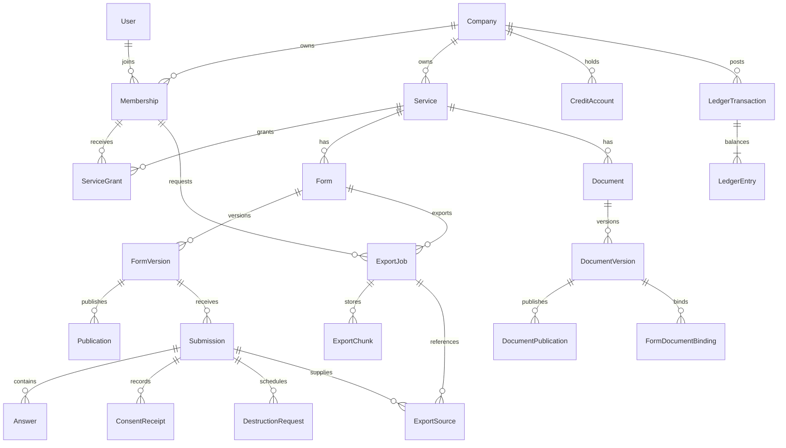

# R00-T03 모델·API·권한 통합 기준선

2026-10-11. 이 문서는 **독립 구현의 설계 계약**이다. 원본 서비스의 내부 DB/API를 알아냈다는 뜻이 아니다. 실제 구현 여부는 OpenAPI의 `x-implementation`, [표면별 상태 계약](../09-rea-fullstack/status-contract.json), 각 Task의 QA 증거를 함께 확인한다. `planned`는 호출 가능한 API가 아니며, `implemented` 표기도 전체 107개 Task의 완료 판정은 아니다.

활성 기준은 원본 선언 186개(구체 184·fallback 2), 독립 제품 부가 경로 21개, 현재 Task 107개와 이력 Task 72개다. [활성 포인터](../active-plan.json)와 [기존 작업 연결표](../09-rea-fullstack/legacy-task-map.json)가 두 계획을 연결하며 기존 상태를 현재 완료로 자동 승격하지 않는다. 역할은 [기계 판독 계약](roles.json), 구형 모델명은 [현재 모델 매핑](model-name-map.json)을 따른다.

## 계약의 네 층

1. [Prisma 모델](../../../prisma/schema.prisma)과 [순서 있는 SQL migration](../../../prisma/migrations/)이 구현된 엔티티의 DDL 기준이다. 아직 구현하지 않은 엔티티의 설계 초안은 [데이터 모델 문서](../01-data-models.md)의 표에 있다. 모델과 migration이 다르면 migration의 실제 DB 제약과 해당 Task의 QA로 확인한다.
2. [OpenAPI 3.1](openapi.json)은 API 경로·method·권한·입력 JSON Schema·HTTP 상태를 기록한다. [API 계약 설명](../02-api-contracts.md)은 도메인 규칙과 UI 상태를 기록한다.
3. [466개 작업별 정책 표](operation-policy-matrix.csv)는 329개 API path의 method별 역할/권한, 회사·서비스/토큰 범위, 유효성, 안전 DTO, 삭제 정책, 금지 동작을 [도메인 정책](domain-policies.json)에서 상속해 고정한다. [검사 스크립트](../../../scripts/verify-contracts.py)는 미매핑 경로·권한·입력 스키마를 실패 처리한다. P06-T06의 설정 API 존재만으로 공급자 challenge/callback/서명·제출 흐름을 완료 판정하지 않는다.
4. [186개 원본 화면 표](../09-rea-fullstack/route-matrix.csv)는 각 화면의 소유 Task, 모델·API, 역할, 정상/오류/권한 상태, 고유 E2E ID를 연결한다. [부가 21개 경로](../09-rea-fullstack/additional-routes.json)는 독립 제품 운영 화면으로 별도 집계한다. 화면 표의 과거 제안 경로와 실제 Route Handler가 다르면 구현 Task의 QA와 OpenAPI의 현재 경로를 우선한다.

## ERD와 DDL 결정

아래는 회사·서비스 범위가 데이터 모델 전반에 어떻게 전파되는지 보여주는 핵심 관계다. 나머지 모델의 필드, FK, unique, CHECK, 트리거와 삭제 정책은 Prisma schema와 migration이 기준이다.

- 전역 User/Notice/Guide/Plan과 회사 자산을 분리한다. 회사 자산의 관계는 `tenantId` 및 가능한 곳에서 `(tenantId, serviceId/id)` 복합 FK로 검증한다. 서비스 grant는 매 요청 다시 검사한다.
- 사용자가 수정할 수 있는 자산은 `version` 또는 `If-Match`로 경합을 처리한다. 게시본·감사·원장·결제 이력은 상태 전이 또는 보정 이벤트로만 바꾼다.
- UTC 저장, 화면·월 필터는 명시된 시간대, 금액은 통화별 최소 단위 정수다. `CreditAccount`/원장 트리거처럼 Prisma schema만으로 표현하지 못하는 규칙은 migration SQL이 기준이다.
- 개발·시험 DB 설치/업그레이드는 P01-T01의 독립 게이트로 남는다. 이 문서의 DDL 확정이 모든 migration 복구 시험을 통과했다는 뜻은 아니다.

## DTO와 오류

각 작업의 성공 상태·설명은 OpenAPI `responses`와 작업별 정책 표의 `response_dto` 열에 있다. `requestBody.content.*.schema`가 있는 변경 API는 그 JSON Schema를 따르며, 필드 경계는 실제 Zod 계약이 더 엄격할 수 있다. 응답은 권한에 맞는 안전 DTO만 반환한다.

| DTO 종류 | 기본 필드와 경계 |
|---|---|
| 목록 | `items`, `total`, `page`, `pageSize`; 검색·정렬 allowlist, 안정적인 ID 보조 정렬 |
| 변경 가능 자산 | `id`, `version`, `status`, 안전한 표시 필드; 변경 시 새 version 반환 |
| 게시/증거 | 고정 version·시각·hash·상태; 과거 본문 제자리 수정 금지 |
| 공개/외부 열람 | 고정 토큰·grant가 허용한 필드만; 내부 ID와 비밀·원문 세션 token 제외 |
| 원장/청구 | `currency`, 최소 단위 정수 문자열, 거래 상태·시각; 카드 원문과 내부 원천 ID 제외 |
| 파일/내보내기 | 명시한 content type·attachment·`private, no-store`; 바이트·hash 검사 후 제공 |

JSON 오류는 `{error:{code,message,fieldErrors?,requestId}}`이며 400 형식, 401 인증, 403 역할/서비스/Origin, 404 범위 밖, 409 버전·중복·상태, 410 만료/회수, 413 크기, 415 형식, 422 필드, 429 요청 제한, 503 공급자 미설정을 구분한다. 실제 공통 처리의 예시는 `INVALID_JSON`, `UNAUTHENTICATED`, `SERVICE_FORBIDDEN`, `NOT_FOUND`, `VERSION_CONFLICT`, `VALIDATION_ERROR`, `RATE_LIMITED`다. 공급자/도메인별 code는 해당 요청의 계약과 QA를 따른다.

## 역할 × 행위

다음은 [실제 역할 capability 표](../../../src/server/permissions.ts)의 요약이다. [roles.json](roles.json)이 소스와 정확히 일치하는지 통합 검증기가 검사한다. 각 OpenAPI 작업의 `x-permission`이 최종 권한 이름이며, 범위는 정책 표에 있다. 플랫폼 운영자는 고객 PII 자동 열람권이 없다.

| 역할 | 조직·서비스 관리 | 폼·문서 작성/게시 | 응답·공유·마케팅 | 발신·캠페인 | 알림 연동 | 결제 | 보안 | 감사 |
|---|---|---|---|---|---|---|---|---|
| owner | 허용 | 허용 | 허용 | 허용 | 허용 | 허용 | 허용 | 허용 |
| admin | 허용 | 허용 | 허용 | 허용 | 허용 | 금지 | 허용 | 허용 |
| editor | 서비스 조회 | 작성·게시 | 금지 | 금지 | 금지 | 금지 | 금지 | 금지 |
| viewer | 서비스 조회 | 조회만 | 금지 | 금지 | 금지 | 금지 | 금지 | 금지 |
| privacy | 서비스 조회 | 폼 조회 | 응답·공유·동의 | 금지 | 금지 | 금지 | 금지 | 허용 |
| sender | 서비스 조회 | 금지 | 마케팅 조회 | 발신·캠페인 | 금지 | 금지 | 금지 | 금지 |
| billing | 서비스 조회 | 금지 | 금지 | 금지 | 금지 | 허용 | 금지 | 금지 |
| security | 서비스 조회 | 폼 조회·승인 | 금지 | 금지 | 금지 | 금지 | 허용 | 허용 |
| auditor | 서비스 조회 | 금지 | 금지 | 금지 | 금지 | 금지 | 금지 | 허용 |

owner/admin 외 역할의 서비스 자산 접근은 별도 `ServiceGrant`가 필요하다. expert 배정은 현재 회사·서비스·만료를 추가로 제한한다. 익명 공개 token, 외부 viewer, 정보주체 세션, 서명된 공급자 webhook은 이 표의 역할로 승격되지 않는다.

## 상태 전이와 삭제 의미

| 자산 | 허용 전이/변경 | 금지 동작 |
|---|---|---|
| 폼/게시 | draft→승인대기→published→paused/archived; 수정은 새 초안/버전 | 게시본 제자리 수정, 승인 우회 |
| 문서/공개 | draft→published→private/archived; 새 DocumentVersion·링크 회수 | 참조된 게시 버전 삭제 |
| 응답/동의 | submitted→corrected/withdrawn→pendingDestruction→destroying→destroyed; 동의는 새 이벤트 | 과거 증거 덮어쓰기, destroying 후 원복 |
| 공유 | active→expired/revoked | 회수 후 기존 viewer 세션 재사용 |
| CSV | uploaded→validated→committing→completed/partialFailed/failed | validate에서 반영, 같은 행 재처리 중복 |
| 캠페인 | draft→scheduled→dispatching→completed/partialFailed/failed | 접수만으로 도달 표기, 확정 전송 자동 재시도 |
| 파기 작업 | pending→scheduled→running→completed 또는 retry/failed/cancelled/rejected | 보존 조치 중 실행, 202를 완료로 표기 |
| 크레딧 | funding→reserve→capture/release의 불변 거래와 균형 항목 | 잔액 직접 수정, 원천 중복 차감 |
| 결제 제안 | pending→authorized/paid→partiallyRefunded/refunded 또는 failed/cancelled | success URL만으로 paid, 승인액 초과 환불 |

정확한 허용 전이와 DB 트리거는 각 구현 Task의 계약·시험으로 확인한다. 결제 제안은 PG sandbox가 없어 아직 실행 계약으로 승격하지 않았다.

## 원본에서 의미를 확인하지 못한 분기

| 항목 | 근거 | 현재 결정 |
|---|---|---|
| `/document/P/:token`, `/document/C/:token`, `/document/OC/:token` | [R162–R164](../03-route-matrix.csv)는 `unavailable-placeholder`; 원본 정상 본문 미관찰 | 약어와 내부 `consent/privacy_policy/overseas_transfer`를 임의로 연결하지 않는다. 원본 매핑 증거 전에는 별칭 공개를 금지한다. |
| 국외이전 문서 | 내부 [문서 계약](../../../src/contracts/documents.ts)은 독립 `overseas_transfer` 유형을 정의 | 같은 서비스의 국외 수탁자(국가 KR 외)와 목적·항목·보유 근거를 확인한 뒤 게시한다. 이 규칙은 원본 P/C/OC의 뜻을 증명하지 않는다. |
| `/customer-use-case/:token` | [R011](../03-route-matrix.csv)의 원본 정상 상태 미관찰 | 자료 범위를 확인할 때까지 응답·PII 공개 계약으로 승격하지 않는다. |
| 그룹웨어 로그인·전자서명·본인인증 | 원본 공급자 callback과 시험 자격증명 없음 | URL 결과만으로 인증/서명 성공 상태를 만들지 않는다. 서명·nonce·event ID와 sandbox 결과가 필요하다. |
| PG·카카오·문자/알림톡 | 공급자 계약/자격증명·단가 정책 미확정 | 제안 API와 실제 연결을 구분한다. 고객 요청 금액·성공 URL만으로 결제/전송/차감을 확정하지 않는다. |

이 결정이 모든 원본 경로의 UX를 관찰했다는 뜻은 아니다. [원본 관찰 상태](../../research/COVERAGE.md)의 제한 경로는 해당 구현 Task에서 다시 확인한다.

## P07-T03 파기 계약 보완

현재 항목별 작업 권한·실제 기한·검색/정렬/페이지·엄격한 쿼리·증명서 무결성 검사를 연결했다. 계약 257경로·376작업·33정책, 매핑/권한/입력 누락 0이며 공식 완료는 15/72다. [검증](../../qa/P07-T03/README.md).

## P07-T01 CSV 현재 계약

현재 작업 권한, 최종 기한, 실행 번호/임대 검사와 엄격한 쿼리·실제 페이지를 연결했다. 계약 257경로·376작업·33정책과 공식 완료 15/72를 유지한다. [검증](../../qa/P07-T01/README.md).

## P07-T02 마케팅 현재 계약

현재 권한·최종 기한·엄격한 쿼리·페이지/정렬·현재 생성 재실행과 사본 정리/재시도를 연결했다. 257경로·376작업·33정책과 공식 완료 15/72를 유지한다. [검증](../../qa/P07-T02/README.md).

### 단건 알림톡 Mock 발송

`POST /kakao/templates/{id}/send`는 `{version}`과 `Idempotency-Key`를 요구한다. 현재 승인된 템플릿과 확인된 채널의 버전·권한을 같은 트랜잭션에서 검사해 `KakaoMockReceipt`와 `kakao.mock_delivered` 감사를 함께 저장한다. 응답은 `mock:true`, `local_delivered`, 독립 영수증 ID 및 당시 템플릿/채널 버전을 포함하는 안전 메타데이터다. 실제 수신자 발송 증명이 아니다. 본문 파일을 만들거나 덮어쓰지 않고 본문/버튼의 조회용 HMAC만 저장한다. 같은 키·버전 재시도는 현재 권한을 다시 확인하고 기존 결과를 반환한다. 기록이 있는 템플릿은 초안으로 바뀌어도 삭제 대신 보관한다. 수신자·동의·실제 캠페인 발송 이력은 기존 `/campaigns` 계약을 사용한다.
