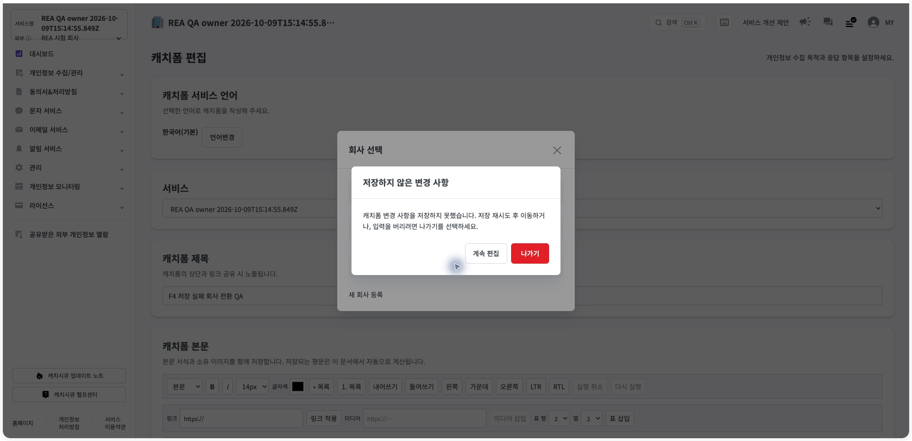
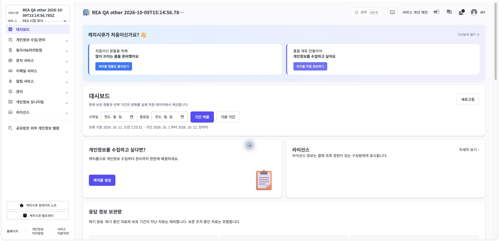
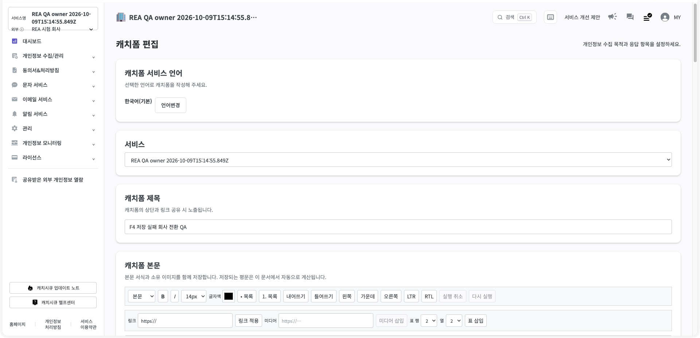

# R08 F4 — 여러 페이지 저장 실패·회사 전환 보호

검증일: 2026-10-11  
결과: **통과**

## 확인한 문제

캐치폼 편집기의 자동저장은 일반 링크 이동을 보호했지만, 공통 헤더의 회사 선택 버튼은 별도 NavigationGuard를 사용했다. 여러 페이지 폼의 저장이 실패한 상태에서 회사를 바꾸면 이 편집 상태가 공통 가드에 등록되지 않아 입력을 잃을 수 있었다.

## 구현

- 폼 초안의 dirty, 저장 중, 저장 실패, 버전 충돌, 검증 실패 상태를 공통 이탈 보호에 연결했다.
- 저장 실패 상태에서는 저장 재시도 후 이동하거나 입력을 버리고 나가도록 안내한다.
- 업로드와 템플릿의 기존 이탈 보호 문구는 그대로 유지한다.
- 저장 응답이 유실된 뒤에도 두 페이지 전체와 동일한 멱등 키·요청 본문으로 재시도한다.
- 현재 회사가 바뀌면 이전 회사 폼과 멱등 응답을 다시 사용할 수 없다.

## 자동 검증

| 항목 | 결과 |
|---|---:|
| 집중 시험 | 2파일 24개 통과 |
| 관련 회귀 | 7파일 97개 통과 |
| TypeScript | 통과 |
| 변경 파일 ESLint | 오류 0, 기존 이미지 경고 1 |
| Production build | 통과, 정적 페이지 82개 |

관련 회귀는 페이지 상태·분기·현재 권한·회사 선택 감사·이탈 보호·초안 상태·PostgreSQL 저장을 포함한다.

## Ego Lite 실제 시나리오

1. 두 페이지 폼에서 production 서버를 중지하고 두 번째 페이지 제목을 수정했다.
2. 자동저장 실패와 저장 재시도 상태를 확인했다.
3. 회사 선택을 실행해 저장 실패 전용 이탈 경고를 확인했다.
4. 계속 편집을 선택했을 때 두 번째 페이지 입력이 유지됐다.
5. 서버를 다시 시작하고 저장 재시도를 실행해 저장 완료를 확인했다.
6. 다른 회사로 전환한 뒤 원래 회사로 돌아와 폼을 다시 열었다.
7. 두 번째 페이지 제목 ‘확인 페이지 · 저장 실패 보존’이 유지됐다.

## PostgreSQL 대조

- 폼 동시성 버전: 2
- 편집 중인 폼 버전 번호: 1
- 페이지 수: 2
- 두 번째 페이지 제목: 확인 페이지 · 저장 실패 보존
- form.draft_updated: 1
- context.company_selected: 2

화면 검증 뒤 합성 폼, 임시 회사 구성원·서비스 권한, QA 세션을 제거했다. 외부 공급자나 자격증명은 사용하지 않았다.

구조화 결과와 소스·스크린샷 SHA-256은 [verification-final.json](verification-final.json)에 있다.

## 남은 R08 범위

이 검증은 F4의 저장 실패 재시도와 회사 전환 조합만 완료한다. F3 외부 공식 본인확인·전자서명, F5 외부 OAuth·SMTP, F6 결제 라이선스, F7 전체 경로 수용은 계속 in_progress 또는 external_pending으로 관리한다.
